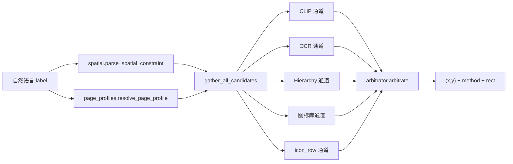
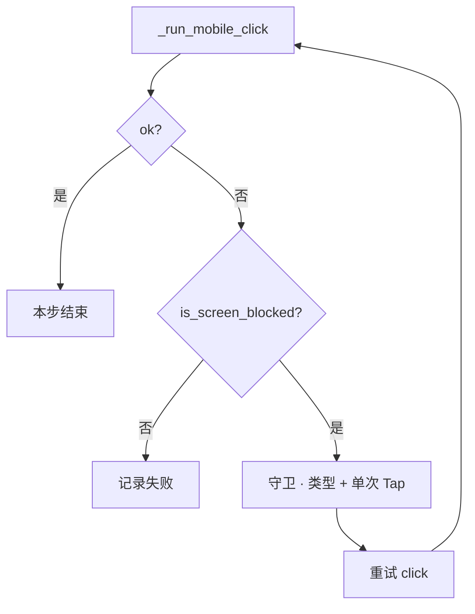

# 定位架构

## 数据流



## 模块职责

| 模块 | 文件 | 职责 |
|------|------|------|
| 入口 | `resolver.py` | 组装 query、调用收集与仲裁 |
| 空间 | `spatial.py` | 方位词 → 九宫格 zone 并集 |
| 页面 | `page_profiles.py` | 页面类型注册表与通道权重 |
| 通道 | `channels.py` | 各通道产出 `LocateCandidate` |
| 仲裁 | `arbitrator.py` | 加权打分、歧义拒绝 |
| 图标行 | `icon_row.py` | 全屏无字图标行聚类 |

## 仲裁公式

对每个候选 `c`：

```
final(c) = norm_score(c) × weight(profile, c.channel) × boost(target_kind, c.channel)
```

- `norm_score`：OCR/Hierarchy 为文本相似度 0~1；CLIP/icon_row 低分区间会轻微放大以便可比  
- `boost`：例如 `TargetKind.TEXT` 提高 ocr/hierarchy，降低 icon_row  
- 取 `final` 最高者；若 top 与 second 差距 < 0.04 且 top < 阈值+0.08，则 **拒绝点击**（防误点）

## 阻塞弹窗守卫（反应式）

定位结果用于业务 Tap；当 **业务点击 miss 且屏阻塞** 时进入守卫：



守卫 Tap 与业务 Tap 共用多通道；consent / `system_permission` 的 profile 见 `resolver.py`。  
回放无 Detect/Recheck 节点，详见 [overlay-guard.md](./overlay-guard.md)。

## 与旧版关系

| 旧概念 | 新位置 |
|--------|--------|
| `login_row` 固定 Y 带 | `icon_row.detect_icon_rows` 全屏聚类 + CLIP patch |
| `infer_region_hint` | 仅作 CLIP 粗 region；精确过滤用 `spatial.zones` |
| `_classify_login_method_intent` | 仅用于 `TargetKind.ICON` 判定与 CLIP query 生成 |
| Tab / 无障碍 label | 主路径已移除；`LOCATE_ARBITRATOR=0` 时旧管道仍可用 |

## 安全路径（不经过仲裁）

以下仍在 `copilot_service._resolve_click_target` 最前处理：

- 显式坐标  
- Consent「同意」安全点击  
- Toggle / 协议勾选  

避免误点《用户协议》链接。

## 页面识别来源

`page_context` 通常来自 `page_context_service.identify_page_for_trace`：

- Figma 设计稿文案匹配  
- 应用图谱节点 label  
- OCR 全文辅助  

映射到 `PageProfile` 后只影响 **权重**，不硬编码走哪条通道。
