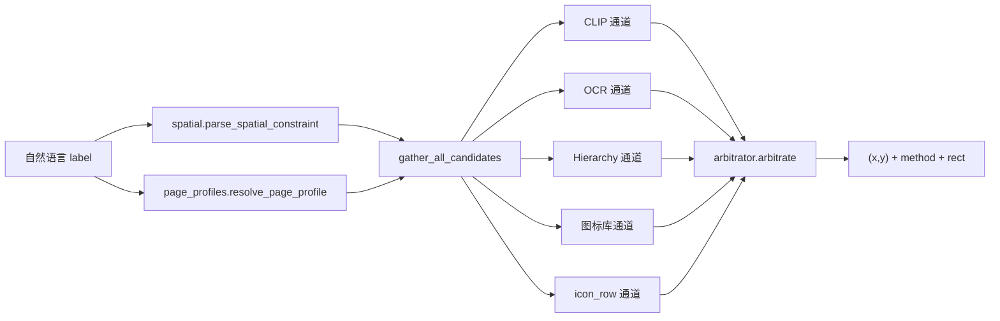
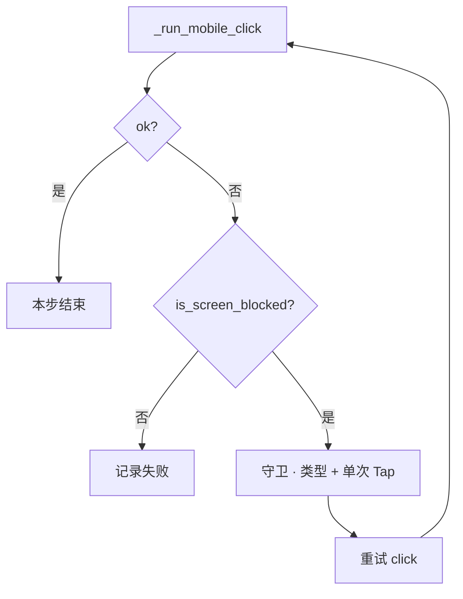

# 定位架构

## 统一屏帧 `screen_frame_service`（性能）

同一步骤、同一手势水位内 **只 `screenshot()` 一次**：

| 模块 | API | 说明 |
|------|-----|------|
| OCR / 屏文 | `get_screen_frame` → `ocr_items` | 一次 RapidOCR |
| CLIP | `get_frame_shot` / 帧内 `shot` | 不单独截图 |
| icon_row / toggle | `get_frame_bgr` | 不单独截图 |
| 阻塞检测 | `get_blocking_screen_state` | 复用帧内 OCR |

手势变更后 `invalidate_screen_frame()` 作废；OCR/CLIP/icon_row 申请到的必须是同一张图。

## 数据流



## 模块职责

| 模块 | 文件 | 职责 |
|------|------|------|
| 入口 | `resolver.py` | 组装 query、调用收集与仲裁 |
| 空间 | `spatial.py` | 方位词 → 九宫格 zone 并集（**唯一**区域硬过滤） |
| 页面 | `page_profiles.py` | 页面类型注册表与通道权重 |
| 通道 | `channels.py` | 各通道全屏产出 `LocateCandidate` |
| 仲裁 | `arbitrator.py` | 加权排序，取最高分 |
| 图标行 | `icon_row.py` | 全屏无字图标行聚类 |
| 屏帧 | `screen_frame_service.py` | 同一步骤单次截图复用 OCR/CLIP |

## 仲裁公式（v0.0.91）

```
weighted(c) = boosted_raw(c) × weight(profile, c.channel)
```

- `boosted_raw`：视觉通道 raw&lt;0.5 时 ×1.35  
- **无** `TargetKind` boost、**无** `min_score`、**无** 歧义 margin 拒绝  
- 候选池非空 → 取得分最高者；consent 屏剔除「不同意」候选  
- `target_kind` 仅写入 `locate_debug` 供回放展示

## 阻塞弹窗守卫（反应式）

定位结果用于业务 Tap；当 **业务点击 miss 且屏阻塞** 时进入守卫：



守卫 Tap 与业务 Tap 共用多通道；consent / `system_permission` 的 profile 见 `resolver.py`。  
回放无 Detect/Recheck 节点，详见 [overlay-guard.md](./overlay-guard.md)。

## 与旧版关系

| 旧概念 | 新位置 |
|--------|--------|
| `login_row` 固定 Y 带 | `icon_row.detect_icon_rows` 全屏聚类 + CLIP patch |
| `infer_region_hint` | 仅作 CLIP 粗 region；精确过滤用 `spatial.zones` |
| `_classify_login_method_intent` | 仅用于 CLIP query / 图标库别名（`icon_intent.py`） |
| `prefer_icon_row` | YAML 遗留字段，**不再**门控 icon_row 收集 |
| Tab / 无障碍 label | 主路径已移除；`LOCATE_ARBITRATOR=0` 时旧管道仍可用 |

## 安全路径（不经过仲裁）

以下仍在 `copilot_service._resolve_click_target` 最前处理：

- 显式坐标  
- Consent「同意」安全点击  
- Toggle / 协议勾选  

避免误点《用户协议》链接。

## 页面识别来源

`page_context` 通常来自 `page_context_service.identify_page_for_trace`：

- Figma 设计稿文案匹配  
- 应用图谱节点 label  
- OCR 全文辅助  

映射到 `PageProfile` 后只影响 **权重**，不硬编码走哪条通道。
