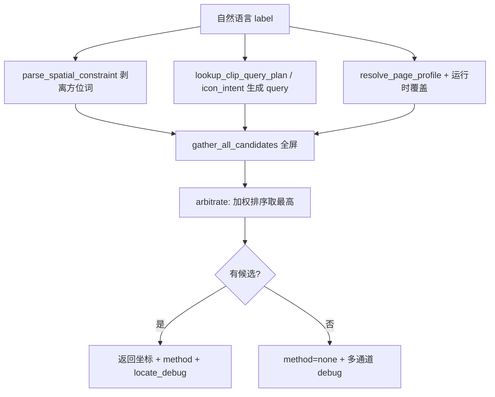

# 多通道定位策略说明

> 供产品 / 测试 / 研发核对行为是否符合预期。  
> 实现入口：`server/services/locate/resolver.py` → `resolve_locate_target`  
> Copilot 集成：`copilot_service._resolve_click_target`（`LOCATE_ARBITRATOR=1` 时默认走本策略）

---

## 1. 要解决什么问题

飞书用例步骤是自然语言，例如：

- 「点击登录页面的手机号登录方式」
- 「勾选底部协议勾选框」
- 「点击同意并继续」

需要把这句话映射为屏幕上的 **(x, y)**。

**核心思路**（v0.0.91）：

1. 多个定位通道 **并行** 产出候选与分数  
2. 根据 **当前屏类型（PageProfile）** 调整各通道 **权重**（不是互斥、不是准入门槛）  
3. **仲裁取加权最高分**；有候选即选第一，无全局 `min_score` / 歧义拒绝  
4. **方位** 仅由 `spatial.py` 九宫格过滤；OCR / Hierarchy / CLIP / icon_row **全屏** 扫描  
5. 失败时仍输出 `locate_debug`，供回放右栏「多通道定位」面板展示  

---

## 2. 端到端流程



### 2.1 在 Copilot 中的调用顺序

`_resolve_click_target` 在走仲裁器之前/之外还有 **安全短路**：

| 优先级 | 条件 | 行为 |
|--------|------|------|
| 0 | 屏被阻塞弹窗占用，且 label 不是关弹窗目标 | 返回 `blocked_overlay`，不定位 |
| 1 | 显式坐标 `x,y` | 直接用坐标 |
| 2 | `LOCATE_ARBITRATOR=1` | **`resolve_locate_target` 多通道仲裁** |
| 3+ | `LOCATE_ARBITRATOR=0` | 旧 hierarchy / OCR / CLIP 管道 |

勾选框 / Toggle：经 `collect_checkable_channel` 进入候选池，channel 记为 `hierarchy`。

---

## 3. 两个诊断维度：profile 与 kind

回放右栏「多通道定位」旁的 `profile=consent · kind=checkbox` **仅供展示**，不参与打分、不设门槛。

### 3.1 Page Profile（页面类型）

**含义**：当前屏更像哪类 UI，用来选各通道的 **基础权重**（`ChannelWeights`）。

解析顺序见 [page-profiles.md](./page-profiles.md)。profile **只调权重**，不决定唯一通道。

### 3.2 Target Kind（目标类型）

由 `classify_target_kind` 从文案推断（text / icon / button / checkbox），**仅写入 `locate_debug`**，不做通道 boost、不设 `min_score`。

---

## 4. 定位通道

所有通道产出 `LocateCandidate`：`cx, cy, score, channel, method, label`。

| 通道 | 来源 | 典型 method | raw score |
|------|------|-------------|-----------|
| **clip** | 全屏 CLIP patch | `clip_*` | 文本-图像相似度；&lt;0.5 时 ×1.35 便于与 OCR 可比 |
| **ocr** | 全屏 OCR 可点击文字框 | `ocr` | 与 query 文本相似度 0~1 |
| **hierarchy** | 全屏无障碍可点击节点 | `hierarchy` / `u2_checkbox` | 文本相似度 |
| **gallery** | 图标库 embedding 全屏检索 | `clip_gallery` | 与图标库模板相似度 |
| **icon_row** | 全屏无字图标行 + CLIP | `clip_icon_row` | 行内 patch CLIP 分 |
| **anchor** | 图标库名称/别名精确匹配 | `icon_anchor` | 固定高分 0.92~0.98 |

### 4.1 候选收集（`gather_all_candidates`）

1. checkable（勾选意图）  
2. anchor（图标库名匹配）  
3. clip（全屏，`region=full`）  
4. text（hierarchy + OCR，**max_items=96，无 Y 带裁剪**）  
5. gallery  
6. icon_row（**默认开启**，全屏聚类，不依赖 `prefer_icon_row`）  
7. 指令含方位词 → `spatial.zones` 硬过滤  

### 4.2 已移除的行为（勿在文档/用例中再依赖）

| 已移除 | 说明 |
|--------|------|
| OCR/Hierarchy Y 带（10–90%、2–98%、底栏 84% 等） | 改为全屏；底栏靠 spatial「底部」 |
| `LOCATE_MIN_SCORE` 仲裁门槛 | 有候选取加权最高 |
| `TargetKind` 通道互斥 / boost | kind 仅展示 |
| `prefer_icon_row` 门控 | YAML 字段保留兼容，**不再**控制是否收集 icon_row |
| CLIP `ambiguous` / 低于 threshold 不进池 | 最高分 patch 一律进候选池（label mismatch 如「不同意」仍拒） |
| 登录专用 `login_row` Y 带 | 见 [icon-row.md](./icon-row.md) 全屏 icon_row |

---

## 5. 打分与仲裁

对每个候选 `c`：

```
weighted(c) = boosted_raw(c) × weight(profile, c.channel)

boosted_raw: 视觉通道 raw<0.5 时 ×1.35
```

**胜出规则（v0.0.91）**：

- 按 `weighted` 降序排序  
- **第一名即为 winner**（候选池非空）  
- `consent` profile：排序前剔除 label 含「不同意」的候选  

无 `min_score`、无 `margin` 歧义拒绝。

### 数值示例

OCR raw=1.0，profile 下 ocr 权重 0.42 → weighted=0.42。  
icon_row raw=0.32 → boosted 0.432，权重 0.08 → weighted≈0.035。  
**OCR 与 icon_row 公平竞争**，谁高用谁。

---

## 6. 空间约束

文件：`spatial.py` — **唯一**允许的屏幕区域硬过滤（右上、底部等）。详见 [spatial-zones.md](./spatial-zones.md)。

---

## 7. CLIP Query Plan

文件：`clip_query_plan.py` + `icon_intent.py`  
自然语言 → `clip_query` / `ocr_queries` / 图标库 aliases；CLIP 搜索区域恒 `full`。

---

## 8. 规划器与飞书步骤

`点击同意并继续` 等短语在 `_split_commands` 中 **整句保护**，不会被「并」拆成 `点击同意` + `继续`。

若规划产生 `segment_errors` 但已执行步骤均成功，**操作仍记 `action_ok=true`**；告警仅出现在 plan_log。预期校验与操作成败分离。

---

## 9. 环境变量

| 变量 | 默认 | 说明 |
|------|------|------|
| `LOCATE_ARBITRATOR` | `1` | `0` 关闭多通道仲裁 |
| `CLIP_ENABLED` | `1` | 关闭后 CLIP / icon_row CLIP 不参与 |
| `LOCATE_PROFILES_PATH` | 内置 YAML | 自定义 page profile 资源包 |

---

## 10. 回放 UI 字段对照

见 `arbitrator.debug_payload`：`query`、`profile`、`target_kind`（展示）、`candidates`、`overlay`、`winner_channel`。

- **raw** = 通道原始分  
- **加权** = `weighted`  
- 选中行 `selected=true`

---

## 11. 文档索引

| 文档 | 内容 |
|------|------|
| [architecture.md](./architecture.md) | 模块划分、屏帧复用 |
| [page-profiles.md](./page-profiles.md) | Profile 与 YAML |
| [icon-row.md](./icon-row.md) | 全屏无字图标行 |
| [overlay-guard.md](./overlay-guard.md) | 反应式守卫 |
| [../regression/CHANGELOG-session.md](../regression/CHANGELOG-session.md) | 版本变更记录 |

---

*文档版本：与 `main` @ **v0.0.91** 一致。*
