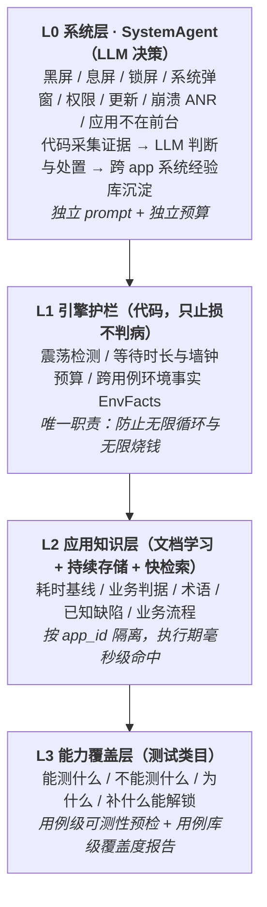
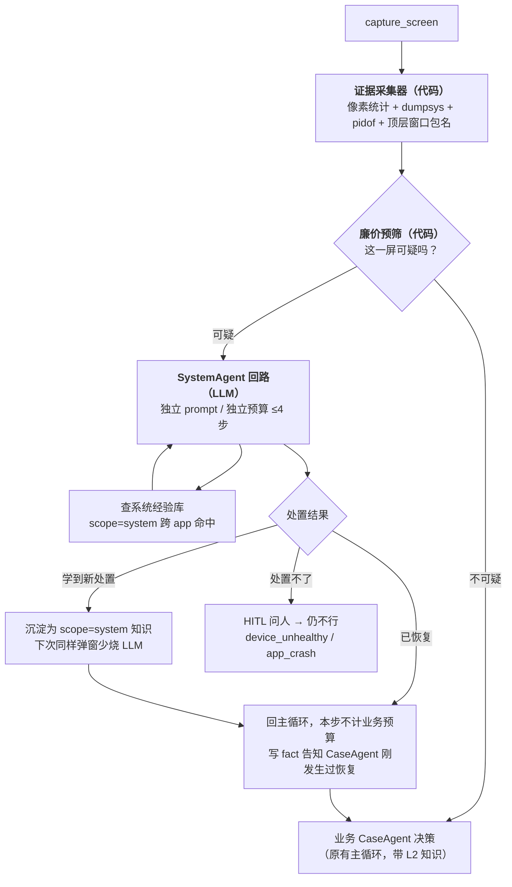
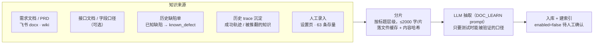
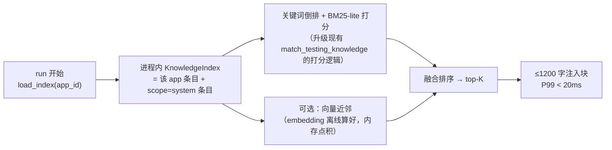
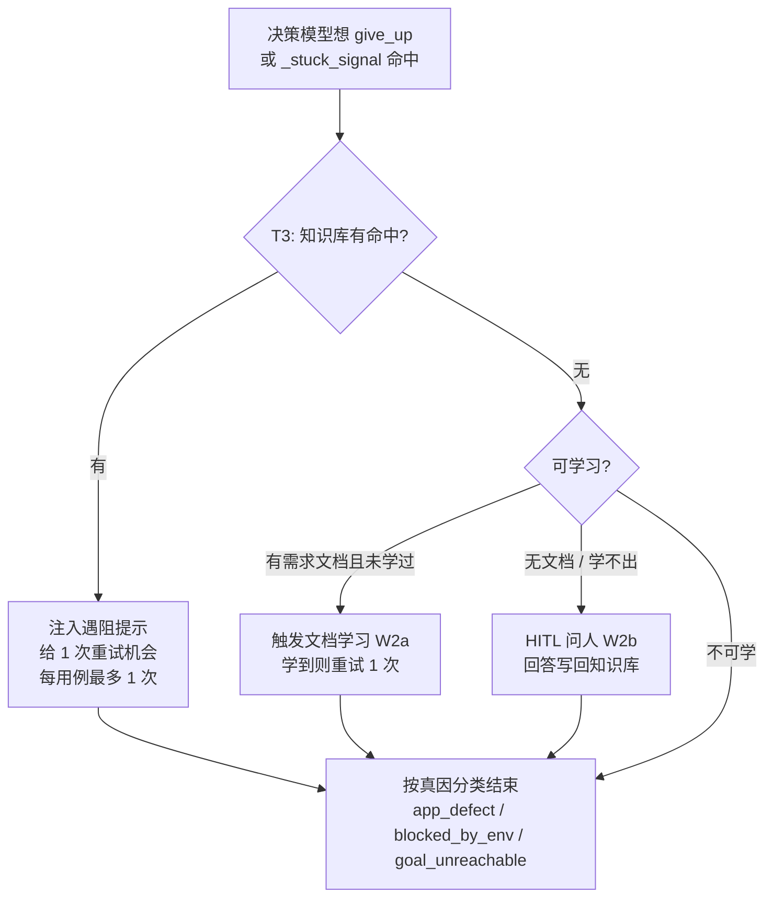
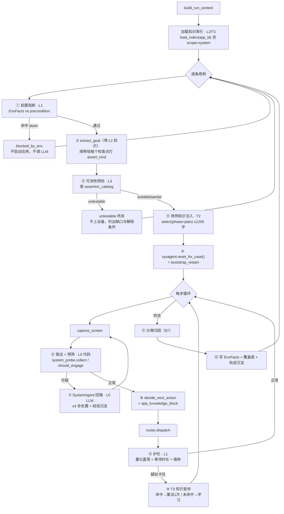

# 回归执行分层方案：系统层自愈 + 应用知识层 + 能力覆盖层

> 目标：把「用例跑挂」从**一次性猜谜**变成**分层归因 + 可积累的解法**，并让「这东西能不能测」变成一张显式的表。
> 四层：**L0 系统层**（LLM 决策 + 跨 app 经验）· **L1 引擎护栏**（只止损）· **L2 应用知识层**（文档学习 + 持续存储 + 快检索）· **L3 能力覆盖层**（测试类目）。
> 基准案例：任务 `898b2038`（`cr-898b203890ac`，13 条 / 3 过 / 10 挂 / 55 分钟）。
> 相关文档：[用任务 ID 找日志](regression/find-task-logs.md)、[执行全链路（旧引擎）](regression/execution-flow.md)、**[本方案的利弊与业界做法对照](plan-review-and-industry-comparison.md)**（含 27 条修订建议）、**[Skill Pack 可插拔方案与控制台](plan-skill-packs-and-console.md)**（本方案的落地形态：四类扩展全部 YAML 化 + 前端交互 + 调试闭环）。

---

## 0. 为什么要分层

`898b2038` 的 10 条失败，真因只有 2 个，但被记成了 3 类 10 条。按「归谁管」拆，问题分成两类：

| 类别 | 现象（实测） | 换个 app 还成立吗 |
|---|---|---|
| **系统 / 设备侧** | 3 条用例开场截图全黑，模型只能连续 `wait_ms` 猜（GEN-010 连等 15 次 / GEN-013 等 5 次 / GEN-012 等到第 26 步）；VIEW-007 连点同一坐标 8 次无人拦 | ✅ 成立 → 归**系统层**：处置能力与经验**跨 app 复用** |
| **应用业务侧** | 不知道"造物相机生成正常要多久"、"『创作出了小问题』是产品失败弹窗而不是环境问题"、"未生成完的缩略图点不动是已知缺陷" → 只能 `give_up` 或烧完预算 | ❌ 不成立 → 归**应用层**：按 `app_id` 隔离的知识库 |

> **两层的分界不是"代码 vs 模型"。** 系统侧场景（各家 ROM 的权限框、更新提示、SIM 卡弹窗、无障碍授权、USB 调试确认、电量优化、输入法、通知横幅、锁屏样式……）是**开放集合，硬编码枚举不完**，所以两层**都由 LLM 决策**。真正的分界是：
> - **知识作用域**：系统层的处置经验对所有 app 通用；应用层的知识只对某个 `app_id` 成立。
> - **预算归属**：系统层有独立预算与独立 prompt，不占、也不污染业务用例的决策预算。
>
> 代码在两层里只干两件事：**采集证据** 和 **兜住止损上限**。判"这是什么问题、该怎么处置"永远交给模型。

### 0.1 现状里已经存在但没接上的东西

方案的大部分零件已经在仓库里，问题是**没接进 agent 主循环**：

| 已有能力 | 位置 | 现状 |
|---|---|---|
| 黑/白帧检测 `shot_is_blank` | `server/services/shared/screenshot/regression_capture.py:14` | 只接在 remote 通道；**adb 通道把全黑 PNG 当 `ok=True` 返回**（`screen.py:50`），agent 拿到黑图只能靠模型描述"全黑" |
| 唤醒/就绪 `ensure_screen_ready` / `screen_on` | `screen.py:266+`（remote 分支） | adb 分支完全没有对应逻辑 |
| 设备体检 SOP（唤醒 / 解锁阶梯） | `driver/agent/Planning/device_doctor.py` | 属于旧 agent 栈，回归引擎不调用。**注意它是写死的 SOP —— 本方案不沿用这种形态**，只借它的"证据 → 阶梯"骨架 |
| 应用知识库（**带 `app_ids` 绑定**） | `system_settings_service.py:789/797/826`，落盘 `config.json` → `testing.knowledge[]` | **已有 63 条**，但只被 `copilot_service` 与设置页读取，**回归 agent 一条都不读**。且 `config.json` 单文件塞 JSON 撑不起持续积累（见 §4.1） |
| 遇阻问人 → 写回知识库 | `execution_clarification_service.py:200`、`failure_knowledge_service.py:161` | 只覆盖"登录页无字图标"一个场景，绑在旧引擎 |
| ~~应用结构知识 `AppGraph / AppNode.is_blocking / AppSOP`~~ | `server/models/AppGraph/app_structure.py` | **本方案废弃它作为执行期知识源**（表与 UI 保留）。理由见 §4.0 |
| 成功轨迹 few-shot | `agent_memory.py`，注入点 `prompts.py:943` | 已接通，但只按 `case_id` 维度，无 app 级知识 |

两条最能说明问题的证据：

1. `config.json` 里有一条人手写的知识 —— 标题「屏幕黑屏」、内容「需要电亮屏幕」、`app_ids: []`。**这本该是代码，不是知识条目**；而它即使写成了知识，agent 也读不到。
2. 63 条知识里 62 条绑在另一个 app（`f6e02aaf`），造物相机（`b5431352`）**零条**。所以这次任务全靠模型现场猜。

而现有的 app 私有逻辑是**硬编码**的（`tap_consent_agree_on_engine`、`is_overlay_dismiss_target_label`，见 [造好物登录方案](regression/zaohaowu-login-solutions.md)）—— 这正是"不同 app 不同逻辑无法通用化归类"的现实写照：每来一个 app 就往引擎里塞一批 if。

---

## 1. 分层原则



### 1.1 分界判据

**问题一**：这个问题换一个被测应用还成立吗？

- **成立** → L0 系统层。处置能力与积累的经验**跨 app 复用**（一次学会小米的"USB 调试授权"框，所有 app 都受益）。
- **不成立** → L2 应用层。知识按 `app_id` 隔离，绝不写进引擎 if 分支。

**问题二**：这件事需要"理解"吗？

- **需要理解**（这屏是什么、该点哪个、算不算失败）→ **交给 LLM**。系统弹窗与业务界面同理，都是开放集合。
- **不需要理解，只需要计数**（试了几次、等了多久、跑了多久）→ **交给代码**，且**只允许它停车，不允许它判病**。

> ⚠️ **本节相对初版的修正**：初版把 L0 定义成"确定性 shell 判定 + 固定恢复阶梯，不进 LLM"。这是错的 —— 系统侧场景是**开放集合**：厂商 ROM 的权限框、系统更新、SIM 卡提示、无障碍授权、USB 调试确认、电量优化白名单、通知横幅、多窗口、锁屏样式……写死判定条件必然漏，漏了就退回"模型盲猜"的老路。
> 现在 L0 的形态是：**代码只负责"取证"与"止损"，LLM 负责"判断"与"处置"，处置经验回流成跨 app 的系统知识库**。硬编码从"判据"退成"传感器"。

### 1.2 三条铁律

1. **L0 的处置必须可审计、可止损**：LLM 决策不受限，但**轮次由代码限制**（默认 ≤4 次决策 / 用例内累计干预 ≤3 轮）。模型不能自己决定"我再试 50 次"。
2. **L0 不许掩盖产品缺陷**：应用崩溃可以重启恢复，但必须把"发生过崩溃 + logcat 片段"写进报告并计入 `app_crashes`，不能静默复活当没事发生。
3. **L2 的知识永远是"参考"不是"脚本"**：知识与当前屏幕冲突时以屏幕为准，并把冲突计入 `refuted_count`（连续 2 次被推翻自动禁用）。


---

## 2. L0 系统层：SystemAgent（系统侧独立决策回路）

系统侧的形态是：**代码取证 → 廉价预筛 → LLM 决策处置 → 经验沉淀成跨 app 系统知识**。代码不判"这是什么问题"，只回答"要不要叫模型来看"。

### 2.1 架构



**为什么单独一个 Agent，而不是把系统处置塞进业务 prompt 的铁律里？**

| 理由 | 说明 |
|---|---|
| 业务 prompt 已经很挤 | `AGENT_DECIDE_USER_TEMPLATE`（`prompts.py:889`）已含目标 + 成功标准 + 检查点 + 设备 + 菜单 + 历史 + 记忆 + 截图，再加 L2 知识块。系统处置铁律继续堆会稀释业务注意力 |
| 判据与动作词表不同 | 系统层"点允许"是安全的、"点拒绝"是危险的；业务层相反要严格避免误点。混在一个 prompt 里容易互相污染 |
| 预算要分账 | 系统干预不该消耗业务决策预算（现在 `898b2038` 里黑屏 wait 全记在业务账上），也要能单独统计"这次跑得干净不干净" |
| 经验作用域不同 | 系统处置经验跨 app 通用，业务经验按 app 隔离。同一个知识库里混存会导致错误的跨 app 泛化 |

### 2.2 证据采集器（代码唯一的职责之一：取证）

采集器只输出**事实**，不输出**结论**。所有字段都可能为 `unknown`（取不到就取不到，不猜）。

```python
# server/services/regression/system_probe.py
@dataclass
class DeviceEvidence:
    # 画面
    blank: str = "no"            # no|black|white   ← 复用 shot_is_blank(regression_capture.py:14)
    frame_delta: float = -1.0    # 与上一帧的感知哈希距离，-1=未知
    # 电源与锁屏
    awake: str = "unknown"       # yes|no|unknown   ← dumpsys power
    locked: str = "unknown"      # yes|no|unknown   ← dumpsys window
    # 应用
    foreground_pkg: str = ""     # dumpsys activity activities | mResumedActivity
    target_alive: str = "unknown"  # pidof <target_package>
    top_window_pkg: str = ""     # dumpsys window windows 顶层窗口所属包
    anr: str = "unknown"         # dumpsys window | 'Application Not Responding'
    ime_shown: str = "unknown"   # dumpsys input_method | mInputShown
    # 崩溃线索（仅在 target_alive=no 或 anr=yes 时抓，避免每步都抓）
    logcat_tail: str = ""        # logcat -d -t 400 --pid=<pid>
```

实现要点：
- 一次 `probe_device_state` 调用批量取回（§2.5 定义的取证 capability），**1s 内结果缓存**，正常屏每步只多一次 shell；
- `logcat_tail` 只在有崩溃线索时抓，直接补上[日志盲区](regression/find-task-logs.md)（`898b2038` 整包 13 条用例没有一条被测应用侧日志）；
- 采集失败**不阻断**，字段留 `unknown` 交给模型判断。

### 2.3 廉价预筛（代码唯一的职责之二：决定是否叫模型）

预筛的判据必须**极宽松且极便宜** —— 它只负责"这屏值不值得多花一次 LLM"，宁可多叫一次，也不要漏。命中任一即唤起 SystemAgent：

| 预筛信号 | 阈值 |
|---|---|
| 画面异常 | `blank != "no"` |
| 明显睡着/锁着 | `awake == "no"` 或 `locked == "yes"` |
| 被测应用不在前台 | `foreground_pkg` 非空且不等于 `target_package` |
| 目标进程没了 | `target_alive == "no"` |
| ANR | `anr == "yes"` |
| 顶层窗口是系统包 | `top_window_pkg` 属于系统包集合（`com.android.*` / `com.miui.*` / `com.samsung.*` …前缀匹配即可，不必穷举） |
| 画面停滞 | 连续 3 步 `frame_delta` 均 ≤ 阈值，且业务侧无有效推进 |

注意最后一条：**预筛不判"卡死"，只判"停滞"**，是否卡死由 SystemAgent 看图决定（可能是正常的长耗时加载 —— 这正是 `898b2038` 里生成加载页的情形，硬编码判不出区别）。


### 2.4 SystemAgent 决策回路（LLM）

被唤起后，SystemAgent 拿到的输入与业务 Agent 完全不同：

```
==== 你的职责 ====
你是设备/系统层处置器。当前业务用例被某种系统或设备状态挡住了，你要把设备恢复到
"被测应用可继续操作"的状态，然后交还给业务流程。你不负责验证业务，也不要做业务操作。

==== 证据（代码采集，可能有 unknown）====
{evidence_json}          ← §2.2 的 DeviceEvidence

==== 被测应用 ====
{target_package}

==== 业务用例正在做什么（一句话，仅供你判断该恢复到哪个页面）====
{case_goal_brief}

==== 本次已尝试的处置（最近在后）====
{system_history_block}

==== 同类情况的既往处置经验（scope=system，跨应用通用；与屏幕冲突时信屏幕）====
{system_knowledge_block}      ← §2.6

==== 可用动作 ====
{system_action_menu}

请看截图 + 证据，输出一个 JSON：
{"thought","status":"recovered|continue|ask_human|declare_unhealthy|declare_app_crash",
 "action":{"capability_id","params"},"learned":"若这次处置值得记住，写成一句可复用的规则（否则空）"}
```

**动作词表刻意比业务层窄，但覆盖系统操作**：

| 动作 | 用途 | 备注 |
|---|---|---|
| `press_key` | POWER 唤醒 / BACK 关框 / HOME 回桌面 | 已有 |
| `swipe_direction` | 上滑解锁、下拉通知栏 | 已有 |
| `tap_element` | **点系统弹窗上的按钮**（允许/以后再说/确定/更新稍后） | 已有；这是硬编码做不到的部分 —— 文案与位置随 ROM 变，只能看图 |
| `input_text` | 锁屏密码 | 已有 |
| `launch_app` / `close_app` | 拉前台 / 重启被测应用 | 已有 |
| `open_settings_page` | 跳系统设置页（权限、电池优化白名单） | **新增**，`am start -a android.settings.*` |
| `wait_ms` | 等系统动画/更新 | 已有 |

> 与业务层的关键差异：**这里允许模型点系统弹窗**。初版把这条列为"刻意不自动点"，是因为当时假设代码判定，怕误点"拒绝"。现在由模型看图决策，配合"点错了的代价"写进 prompt（`禁止点击"拒绝/不允许/退出登录/清除数据"`），既能覆盖长尾又可控。

**止损由代码兜（不由模型决定）**：

| 限制 | 默认值 | 超限后 |
|---|---|---|
| SystemAgent 单次唤起的决策步数 | 4 | 返回 `declare_unhealthy` |
| 单条用例内 SystemAgent 唤起轮数 | 3 | 直接 `device_unhealthy`，不再唤起 |
| 单条用例内应用崩溃次数 | 2 | 直接 `app_crash`（附 logcat），不再恢复 |
| SystemAgent 累计墙钟 | 90s/用例 | 计入用例墙钟预算（§3.2） |

处置不了时的升级链：`SystemAgent → HITL 问人（复用 hitl_executor）→ device_unhealthy`。

### 2.5 落地方式：系统动作不进业务 prompt 菜单

`available_menu_brief`（`menu.py:21`）会把所有 capability 塞进 prompt 菜单。系统动作若进了业务菜单，业务 Agent 会自己去调（比如没事乱按 POWER），反而多烧决策步。

做法：capability 增加**可见域**标记，一个 capability 可以同时对系统层可见、对业务层不可见。

```yaml
# plugins/capabilities/probe_device_state.yaml（新增）
id: probe_device_state
display_name: 读取设备运行态
event_kind: probe_device_state
category: system
description: 批量读取 power/keyguard/前台 Activity/ANR/IME 状态，供 SystemAgent 取证
platforms: [android]
needs_vlm: false
visible_to: [system]        # ← 新增字段：system|case|both（缺省 both，向后兼容）

implementations:
  - id: adb_dumpsys_batch
    executor: adb
    requires_caps: [read_system_data]
    low_level:
      shell: "{shell_command}"
    cost: 1

ui:
  shown_in_settings: false
```

```yaml
# plugins/capabilities/open_settings_page.yaml（新增）
id: open_settings_page
visible_to: [system]
implementations:
  - id: adb_am_start
    executor: adb
    low_level:
      shell: "am start -a {settings_action}"   # 白名单校验，仅允许 android.settings.* 前缀
    cost: 1
```

配套改动：

- `menu.py:21` `available_menu_brief` 增加 `audience: str = "case"` 参数，按 `visible_to` 过滤；SystemAgent 调用时传 `audience="system"`；
- `adb_executor.py:40` `_SUPPORTED_CAPS` 与 dispatch 表增加 `probe_device_state`（返回结构化 `raw_response`）与 `open_settings_page`（action 白名单）；
- 现有 `press_key` / `swipe_direction` / `tap_element` 等**不改 YAML**（`visible_to` 缺省 `both`），SystemAgent 直接复用。

### 2.6 系统经验库：让长尾靠"学"而不是靠"写"

这是回应"系统内容很多，硬编码解决不了所有问题"的核心机制：**每次 SystemAgent 成功处置一个新的系统状况，把处置规则沉淀下来，下次同样的状况少烧 LLM、更快收敛。**

- 存储：与应用知识同一套持久化（§4.1），但 `app_id = "*"`、`scope = "system"` —— **跨 app 共享**；
- 写入：SystemAgent 输出 `learned` 字段且本轮 `status=recovered` 时写入，`confidence` 初始 0.5，`source=learned:<run_id>`；
- 读取：唤起时按证据特征（`top_window_pkg` + 屏上文案 OCR 片段）检索 top-3 注入；
- 收敛：`hit_count` 增长且未被推翻的条目升到 `confidence≥0.8` 后，可**跳过 LLM 直接执行**（退化成快路径，等价于"自动生成的硬编码"，但来源可溯、可禁用）。

条目示例（跨 app 通用）：

```yaml
---
kind: system_handling
scope: system
when: "顶层窗口包名 com.android.permissioncontroller，屏上有『仅在使用该应用时允许』"
then: "点『仅在使用该应用时允许』；禁止点『不允许』"
confidence: 0.9
source: learned:cr-xxxx
hit_count: 17
---
```

> 这条机制让 L0 的覆盖面**随使用增长**：第一次遇到某厂商的弹窗要花 2~3 次 LLM 决策，之后就是一次命中。相比硬编码，长尾覆盖能力和维护成本都更优。


### 2.7 新模块骨架与主循环改动

```python
# server/services/regression/system_agent.py
"""L0 系统层：证据 + 截图 → LLM 决策处置 → 经验沉淀。代码只管取证与止损。"""

@dataclass
class SystemVerdict:
    outcome: str = "clean"     # clean|recovered|unhealthy|app_crash|needs_human
    symptom: str = ""          # 由模型给出的自然语言症状（不是代码枚举）
    actions: list[dict] = field(default_factory=list)   # 实际执行过的处置
    llm_steps: int = 0
    logcat: str = ""
    note: str = ""             # 回灌给业务 Agent 的一句话
    learned: str = ""          # 待沉淀的系统经验（空=无新经验）

class SystemAgent:
    def __init__(self, ctx, router, *, run_id="", provider_id=None,
                 max_steps=4, max_rounds_per_case=3, max_wall_sec=90): ...

    def reset_for_case(self) -> None:
        """每条用例开始时清空轮数/崩溃计数。"""

    def should_engage(self, screen, evidence) -> str:
        """§2.3 廉价预筛。返回非空字符串=可疑原因（仅用于日志），空=放行。"""

    def handle(self, screen, evidence, *, case_goal_brief: str) -> SystemVerdict:
        """§2.4 决策回路。内部自带 ≤max_steps 次 LLM 决策 + 动作执行 + 重新取证。"""
```

主循环改动（`agent_executor.py:317` 之后）：

```python
screen = capture_screen(...)
if not screen.has_image():
    ...  # 保持现有逻辑

evidence = system_probe.collect(self.ctx, screen, prev_phash=self._last_phash)   # ← 代码取证
if self.sysagent.should_engage(screen, evidence):                                # ← 代码预筛
    v = self.sysagent.handle(screen, evidence, case_goal_brief=self.goal.goal)   # ← LLM 处置
    self._record_system_events(step_idx, v)        # 落 trace（含 logcat / 每步动作）
    if v.outcome in ("unhealthy", "app_crash", "needs_human"):
        decline_reason = v.symptom or "系统层无法恢复"
        failure_category = {"unhealthy": "device_unhealthy",
                            "app_crash": "app_crash",
                            "needs_human": "needs_human"}[v.outcome]
        break
    if v.outcome == "recovered":
        if v.note:
            self._remember("fact", v.note)         # 告诉业务 Agent 刚发生过恢复
        if v.learned:
            app_knowledge.record_learned(app_id="*", item=_as_system_item(v.learned))
        continue                                   # 重新截图，本步不计业务预算
```

### 2.8 记账与可见性

- SystemAgent 的每一步以 `event_kind="system"`、`capability_id="system_<动作>"` 落 `event_results`，**不进 `_decision_used`、不进 `_wait_rounds`**；
- `RunReport` 新增 `env_interventions`（唤起轮数）、`env_llm_steps`（系统层 LLM 步数）、`app_crashes`，让"这次跑得干净不干净"是几个数字，而不是埋在 22 条 `wait_ms` 里；
- 崩溃 logcat 落 `EventResult.raw_response`，补上[日志盲区](regression/find-task-logs.md)；
- 系统层与业务层的 trace 在回放 UI 上**分色显示**，避免"到底是环境折腾还是业务在走"看不出来。

---

## 3. L1 引擎护栏：只止损，不判病

这一层是**纯代码**，但它的职责被严格限定：**只做计数与停车，不做任何"这是什么问题"的判断**。判断一律上交 L0（系统侧）或 L2+模型（业务侧）。不修这四处，L0/L2 的效果会被吃掉。

### 3.1 震荡检测被 ±2px 抖动绕过

现状 `agent_executor.py:867-875` 要求连续 3 步 `str(params)` 与 `screen_hash` **全等**，而 `_screen_hash`（`:118`）是整张截图的 sha1：

- VLM 每次坐标漂 1~2px（VIEW-007 实测：`455,2094 → 450,2081 → 462,2094 → 456,2086 → 460,2089 → 461,2092 → 462,2092`）→ 第一项永不相等；
- 状态栏时钟、加载动画每帧像素都变 → 第二项永不相等。

所以它实际只能抓黑屏（纯黑帧字节恰好全等）。改法：

```python
def _action_sig(self, s: _Step) -> tuple:
    p = dict(s.params or {})
    for k in ("x", "y", "from_x", "from_y", "to_x", "to_y"):
        if k in p:
            try: p[k] = int(p[k]) // 24        # 归一化坐标网格量化（1000/24 ≈ 40 格）
            except (TypeError, ValueError): pass
    return (s.capability_id, tuple(sorted(p.items())))

def _is_oscillating(self) -> bool:
    w = self.opts.oscillation_window
    if len(self.steps) < w: return False
    tail = self.steps[-w:]
    if not tail[0].capability_id: return False
    if any(self._action_sig(s) != self._action_sig(tail[0]) for s in tail): return False
    # 屏幕"几乎没变"用感知哈希 + 汉明距离，裁掉顶部状态栏
    return all(_phash_close(s.phash, tail[0].phash) for s in tail)
```

`_Step` 增加 `phash: str`，由 `_dhash(image, crop_top_pct=4)` 计算（`shot_is_blank` 已经引了 numpy，无新依赖）；阈值汉明距离 ≤ 6。

> 效果校验：VIEW-007 第 11~18 步会在第 13 步被拦下，省掉 5 次无效点击，并把 `failure_category` 从 `budget_exhausted` 纠正为 `execution_error`/`app_defect`——那条真缺陷就不会再被埋。

### 3.2 等待上限按次数而不按时长

`max_wait_rounds: int = 15`（`agent_executor.py:90`），但每次 `wait_ms` 的时长由模型自定（实测 5s → 45s）。GEN-012 因此合法地在**一条用例里等了 18 分钟**；全仓 grep 无 `deadline` / `case_timeout`，即**没有单条用例的墙钟预算**。

```python
# AgentOptions 新增
max_wait_total_sec: int = 180      # 单条用例累计等待上限
max_case_wall_sec: int = 480       # 单条用例墙钟上限（含 LLM 与 dispatch）
```

- `wait_ms` 单次上限收到 10s（模型给更大值就截断并在 history 里回灌"单次等待已截断为 10s"）；
- 累计等待超 `max_wait_total_sec` → `decline_reason="累计等待 {n}s 仍未就绪"`，分类 `budget_exhausted`；
- 墙钟超 `max_case_wall_sec` → 分类 `budget_exhausted`，`decline_reason` 写清是墙钟而非步数。

### 3.3 框架自身故障被伪装成产品问题

`planner.py:959-962`：LLM 返回空 / 解析失败时返回 `status="give_up"`，主循环（`agent_executor.py:374-380`）把它归成 `goal_unreachable` —— VIEW-002 就是这样被记成"目标不可达"的（历史任务 `cr-4a4f141c8f6c` 的 FEED-004 同样）。

改法：`AgentDecision` 增加 `status="llm_error"`，主循环遇到时**同参数重试 1 次**，仍失败则 `failure_category="llm_error"`，不计入产品失败率。

### 3.4 跨用例环境事实 EnvFacts（前置阻断）

`898b2038` 最大的时间浪费：GEN 阶段已经证明"生成链路不可用"，后面 7 条前置写着"至少一路风格生成成功"的 VIEW 用例仍各自重新拍照→重新生成→等到超时。`precondition` 目前只是拼进 prompt 的文本（`case_runner.py:334-349`），没有任何阻断力。

引入 run 级事实表（**内存态，不建表**，随 run 结束消失，落进 `payload.env_facts` 便于复盘）：

```python
# run_doc["env_facts"]: dict[str, dict]
{
  "generation_pipeline": {
    "state": "down",                       # ok | degraded | down
    "evidence": "CAM-GEN-013 进度 0% 停滞；CAM-VIEW-001 两次弹生成失败",
    "from_cases": ["CAM-GEN-013", "CAM-VIEW-001"],
    "at": "2026-08-18T14:26:15",
  }
}
```

- **谁写**：一条用例终态后（`case_runner.py:778` 汇总处），按 `failure_category` + `decline_reason` 匹配 L2 知识库里声明的 `env_fact_rules`（见 §4.5 `kind=capability_probe`）。规则来自 app 知识库 → **判定标准本身也是应用私有的**，引擎不写死"生成失败"这种业务词。
- **谁读**：下一条用例开跑前（`case_runner.py:652` 循环开头），把 `spec.preconditions` 与 `env_facts` 做匹配；命中 `state=down` 的依赖 → 直接落 `status="blocked"`、`failure_category="blocked_by_env"`，`summary` 引用证据用例号，**不启动应用、不调 LLM**。
- **兜底**：`env_facts` 只在同一 run 内有效；`--force-all` 参数可关闭阻断（用于验证"是否真的还挂着"）。

> 效果估算：`898b2038` 的 7 条 VIEW 用例会在 GEN-013 挂掉后被直接标 blocked，任务从 55 分钟压到 ~15 分钟，且看板上从 10 条红变成"1 条环境阻断 + 7 条 blocked + 2 条真失败"。

---

## 4. L2 应用知识层：Ingest / Store / Serve

这一层回答：**从哪学**（§4.1 流水线）、**存在哪**（§4.2 持续存储）、**执行时怎么快速取到**（§4.3 快检索）、**什么时候读**（§4.4）、**怎么进模型**（§4.5）、**什么时候写**（§4.6 学习）、**长什么样**（§4.7 schema）。

### 4.0 为什么废弃 AppGraph / AppSOP 这条线

初版把 `AppGraph / AppNode.is_blocking / AppSOP(logic_rules)` 列为知识源之一。**撤掉**，理由：

| 问题 | 说明 |
|---|---|
| 靠 UI 手工圈页面，覆盖不了长尾 | 造物相机的图谱现状：`app_graph` 3 条、`app_nodes` 62 条里属于该 app 的只有 **2 个 node（都叫"首页"）**，`app_sops` 2 条且 `logic_rules` 全是 `{}`。这不是"数据还没录"，是**这种录入形态本身撑不起来** —— 一个 app 几百个页面状态，手工连边的维护成本与实际收益不成比例 |
| 结构表达不了测试要的东西 | 测试需要的是"生成正常要 60~180s"、"『创作出了小问题』算产品失败"这类**判据与口径**，不是"页面 A 点按钮到页面 B"的拓扑 |
| 无溯源、无置信度、无失效 | 图谱里的一条边不知道来源、不知道什么时候过期，被推翻了也无从记录。而测试知识必须能回答"你凭什么这么判" |
| 与 SOP 形态冲突 | `AppSOP.logic_rules` 是写死的步骤序列，本质是脚本。本方案的立场是知识=参考、模型=决策，脚本化 SOP 会把 agent 退回固定流程 |

处理方式：**表和 UI 保留**（图谱本身对人看结构、对 Figma 同步仍有价值），但**执行链路不再读它**。取而代之的是下面的 Ingest/Store/Serve 三段能力。

### 4.1 Ingest：学习文档能力（离线）



抽取的**产出约束**（写进 DOC_LEARN prompt，这是学习质量的关键）：

- 只允许输出**可被验证的口径**：耗时区间、数量规则、文案要求、状态机规则、边界条件；
- 明确**禁止**输出实现细节、架构描述、主观形容（"体验流畅"这类无法判定的不要）；
- 每条必须带 `evidence`（原文片段）+ `source`（文档 URL + 段落定位），否则丢弃；
- 同一事实重复出现只保留一条，`revision` 递增；
- 文档更新后按**内容哈希**做增量：只重抽变化的分片，未变分片的条目保留 `hit_count` 等统计。

飞书通路的现状与缺口：

| 能力 | 现状 |
|---|---|
| wiki 节点 → obj_token | ✅ 已有 `feishu_service._wiki_get_node()` `:118` |
| 表格读取（用例） | ✅ 已有 `fetch_sheet_values()` `:238` |
| **文档正文读取** | ❌ **缺**，需新增 `fetch_doc_raw_content(doc_token)` → `GET /open-apis/docx/v1/documents/{token}/raw_content` |

配置：`app.env` 新增 `knowledge_sources: [{type, url, title, enabled, synced_at, content_hash}]`，与已有 `env.feishu`（用例表）平级，复用同一 `bot_id`。

### 4.2 Store：持续存储能力

**明确改掉初版的"不建表"结论。** `config.json` → `testing.knowledge[]` 撑不起持续积累：全量读写单个 JSON 文件、无并发控制、无索引、无版本、无统计字段，条目到几千条就不可用。

新增两张表：

```python
# server/models/app_knowledge.py
class AppKnowledgeSource(Base):
    """知识来源：一个文档/一个缺陷库/一次 run 沉淀。用于溯源与增量同步。"""
    __tablename__ = "app_knowledge_sources"
    id            = Column(Integer, primary_key=True)
    app_id        = Column(String, index=True)      # "*" = 跨 app（系统层经验）
    type          = Column(String)                  # doc|defect|manual|learned|trajectory
    url           = Column(String, nullable=True)
    title         = Column(String, nullable=True)
    content_hash  = Column(String, nullable=True)   # 增量同步用
    synced_at     = Column(DateTime, nullable=True)
    status         = Column(String, default="ok")   # ok|auth_error|parse_error
    meta          = Column(JSON, default=dict)

class AppKnowledgeItem(Base):
    """一条可被执行期使用的知识。"""
    __tablename__ = "app_knowledge_items"
    id            = Column(Integer, primary_key=True)
    uid           = Column(String, unique=True, default=lambda: uuid.uuid4().hex[:12])
    app_id        = Column(String, index=True)      # "*" = 系统层，跨 app 共享
    source_id     = Column(Integer, ForeignKey("app_knowledge_sources.id"), index=True)

    kind          = Column(String, index=True)      # §4.7 分类
    scope         = Column(String, default="*")     # 页面/模块，"*"=全应用
    when_text     = Column(Text)                    # 触发条件
    then_text     = Column(Text)                    # 结论 / 动作口径
    evidence      = Column(Text, default="")
    assert_kinds  = Column(JSON, default=list)      # 关联的测试类目（§5）

    confidence    = Column(Float, default=0.5)
    revision      = Column(Integer, default=1)
    enabled       = Column(Boolean, default=True)
    hit_count     = Column(Integer, default=0)      # 被命中并采纳
    refuted_count = Column(Integer, default=0)      # 被屏幕推翻 → ≥2 自动禁用
    expires_at    = Column(DateTime, nullable=True)

    keywords      = Column(JSON, default=list)      # 预抽关键词，供快检索
    embedding     = Column(LargeBinary, nullable=True)  # 可选向量，离线算好
    created_at    = Column(DateTime, default=datetime.now)
    updated_at    = Column(DateTime, onupdate=datetime.now)
```

配套：

- **迁移脚本**把现有 63 条 `testing.knowledge[]` 一次性导入（`source.type=manual`），设置页读写切到新表，`config.json` 里的旧字段保留只读兼容一个版本；
- 文档**分片正文**不入库，落 `APP_DATA_DIR/data/app_docs/<app_id>/<source_id>/<chunk>.txt`（与 `agent_memory` 的轻量文件存储一致），库里只存条目与索引；
- `refuted_count>=2 → enabled=false` 由代码强制，不依赖人工。

### 4.3 Serve：执行期快速响应

执行期是**在线路径**，绝不允许现场读文档、现场调 embedding 接口、更不允许调 LLM 做检索。



设计要点：

- **一次加载**：`run` 开始按 `app_id` 把条目全量读进内存（几千条 ≈ 几 MB，完全放得下），后续检索零 IO；
- **两路召回**：关键词（复用 `match_testing_knowledge` `:826` 已有的 title/content/tag 加权思路，改为在内存索引上跑）+ 可选向量（embedding 在 Ingest 阶段离线算好存 blob，执行期只做点积）；
- **打分因子**：文本相关度 × `confidence` × 新鲜度（`updated_at`）× `scope` 匹配度，命中后 `hit_count += 1`（异步批量回写，不阻塞执行）；
- **性能红线**：单次检索 P99 < 20ms；超时/异常一律**降级为空块**，绝不阻断用例执行；
- **失效**：`expires_at` 过期或 `enabled=false` 的条目在加载时就被过滤掉。

统一出口（模块对外只 4 个函数）：

```python
# server/services/regression/app_knowledge.py
def load_index(app_id: str) -> KnowledgeIndex: ...          # run 开始，含 scope=system
def select(index, *, case_spec=None, phase: str, screen_text: str = "",
           assert_kind: str = "", max_chars: int = 1200) -> str: ...
def record_learned(app_id: str, item: KnowledgeItem) -> KnowledgeItem: ...
def mark_refuted(item_uid: str, reason: str) -> None: ...   # 屏幕推翻时调用
```


### 4.4 什么时候读：三个时机，各读各的量

这是关键设计——**不能每步都把全量知识塞进 prompt**（会挤掉截图和历史的 token，还会让模型盲从过时知识）。

| 时机 | 触发点（代码位置） | 频率 | 读什么 | 注入到哪 |
|---|---|---|---|---|
| **T1 加载** | `case_runner._execute()` 构造 `ctx` 之后（`case_runner.py:594` 之后） | **每任务 1 次** | `load_index(app_id)` 全量（含 `scope=system` 系统经验） | 挂到 `RunContext.knowledge_index`（新增字段，不进 `to_prompt_brief`） |
| **T2 常驻块** | 每条用例开始，`run_agent_case()` 内 `extract_goal` 之前（`agent_executor.py:924`） | **每用例 1 次** | `select(phase="plan")`：与该用例文本相关的 `timing / term / constraint / known_defect` + 全局 `blocking_ui` | ① `extract_goal` prompt（让检查点带上正确口径）② `decide` 的常驻 `app_knowledge_block`，整条用例复用同一份，**硬上限 1200 字** |
| **T3 遇阻块** | 检测到卡住时（`_is_oscillating()` 命中前一步、`wait` 累计过半、`assert_visual` 连续 2 次失败、模型给出 `give_up` 前） | **按需，每用例 ≤2 次** | `select(phase="stuck", screen_text=<当前屏 OCR/层级文案>)`：优先 `flow`（SOP 步骤）、`known_defect`、`blocking_ui` | 追加一个临时块「遇阻提示（本次仅供参考）」，只在下一步 decide 生效，用完即丢 |

T3 的门控逻辑（新增在 `agent_executor.py` 主循环里）：

```python
def _stuck_signal(self) -> str:
    """返回非空表示"疑似卡住"，用于触发 T3 知识查询。比 give_up 早一步。"""
    if self._wait_secs_total > self.opts.max_wait_total_sec * 0.5:
        return "long_wait"
    if len(self.steps) >= 2 and self._action_sig(self.steps[-1]) == self._action_sig(self.steps[-2]):
        return "repeat_action"
    if self._consec_assert_fail >= 2:
        return "assert_repeat_fail"
    return ""
```

**关键顺序：先查知识，再决定放弃。** 现在的 `give_up` 是终点；改造后 `give_up` 前必须先过一次 T3：



### 4.5 怎么读进模型：新增一个 prompt 块

`prompts.py` 已有两个可选块的成例——`baseline_hint_block` 与 `hierarchy_block`（`prompts.py:937-948`）。照同样方式加第三个，位置放在 `memory_block` 之后、截图之前：

```python
# prompts.py: AGENT_DECIDE_USER_TEMPLATE 尾部
{baseline_hint_block}{app_knowledge_block}{hierarchy_block}
```

```python
# prompts.py: build_agent_decide_messages 新增参数 app_knowledge: str = ""
app_knowledge_block = ""
if app_knowledge and app_knowledge.strip():
    app_knowledge_block = (
        "\n==== 本应用已知情况（人工/文档/历史沉淀；**以当前真实屏幕为准**）====\n"
        "下列是本被测应用的既有认知。屏幕与它冲突时**信屏幕**，并在 thought 里写明冲突点。\n"
        f"{app_knowledge.strip()[:1200]}\n"
    )
```

同时在 `AGENT_DECIDE_SYSTEM_PROMPT`（`prompts.py:845`）铁律里补两条：

```
14. 【本应用已知情况】是参考不是脚本：与屏幕冲突时以屏幕为准，并在 thought 写"知识与实况不符：…"。
15. 已知缺陷命中时（知识里标 known_defect 且当前屏与之吻合）→ status="give_up"，
    thought 首句写 "命中已知缺陷 <id>"，不要反复重试同一个点击。
```

第 15 条直接解决 `898b2038` 里 VIEW-007 连点 8 次的浪费：知识库一旦记下"未生成完的风格缩略图点击无响应（CAM-VIEW-007 复现 4/4）"，下次撞上就一步收敛。

调用链上的参数传递（3 处小改）：

| 文件 | 改什么 |
|---|---|
| `planner.py:913` `decide_next_action` | 新增 `app_knowledge: str = ""`，透传给 `build_agent_decide_messages` |
| `agent_executor.py:335` 调用处 | 传 `app_knowledge=self._knowledge_block()`（常驻 T2 + 临时 T3 拼接） |
| `planner.py` `extract_goal` | 新增 `app_knowledge` 参数，让检查点抽取也能看到术语/口径 |

### 4.6 什么时候写：学习能力的三个入口

| 入口 | 触发 | 输入 | 产出 | 人工闸门 |
|---|---|---|---|---|
| **W1 文档学习**（离线） | 手动点「学习需求文档」；或 run 前检查 `doc_synced_at` 超过 7 天 | 飞书 docx/wiki 正文 | 一批 `kind=constraint\|term\|flow\|timing` 条目 | **默认 `enabled=false`，需人工在设置页确认后生效** |
| **W2 遇阻学习**（在线，本方案核心） | §4.2 的 T3 未命中 | 当前屏截图 + 目标 + 失败历史 + 文档片段 | 1 条 `source=learned:<run_id>`、`confidence≤0.6` 的条目 | 自动生效但标低置信；连续 2 次被屏幕推翻则自动禁用 |
| **W3 轨迹沉淀**（已有，升级） | 用例 pass | `agent_memory` 成功轨迹 | 由 `case_id` 维度升级为附带 `app_id` + 页面特征的 `kind=flow` 片段 | 无需（只是参考路径） |

**W2 的两条分支**：

- **W2a 先问文档**：该 app 有文档来源且本用例未查过 → 用「目标 + 当前屏文案」检索文档分片，命中则抽成条目 → 注入 → 给该用例**1 次重试**。
- **W2b 再问人**：无文档或抽不出 → 走已有 HITL 通道（`hitl_executor.py`）问一个**具体**问题（"造物相机三路生成正常耗时多久？超过多久应判失败？"），回答经 `record_learned()` 落库。这条复用 `execution_clarification_service.py:200` 已经验证过的"问人 → 写回知识库"模式，只是把场景从"登录图标"泛化了。

**防发散的硬约束**（很重要，否则 agent 会陷入"学习—重试—再学习"的循环）：

- 每条用例 **最多 1 次 T3 命中重试 + 最多 1 次学习触发**；
- 学习动作**不占决策预算**，但占墙钟预算（§3.2 的 `max_case_wall_sec` 照常生效）；
- 学习产出的条目带 `run_id` 溯源；被屏幕推翻 2 次自动 `enabled=false`，避免错知识长期毒害（**错知识比没知识更坏**）。

### 4.7 知识条目 schema：必须机器可用

现有 63 条知识是纯自然语言（如「屏幕黑屏 / 需要电亮屏幕」），模型能读但引擎无法据此做判定。新条目在 `content` 里内嵌一段 YAML front-matter 式结构（**存储不变，仍是 `testing.knowledge[].content`，向后兼容**）：

```yaml
---
kind: timing                  # timing|blocking_ui|term|flow|constraint|known_defect|capability_probe
scope: "生成展示页"
when: "点击『直接开造』后出现『脑洞正在加载中 N%』"
then: "正常 60~180s 完成三路；>240s 或进度 60s 无变化即判生成链路异常，不要继续等"
evidence: "cr-4a4f141c8f6c / cr-898b203890ac 实测"
confidence: 0.8
source: "learned:cr-898b203890ac"
---
（自然语言补充说明，人读用）
```

造物相机的三条真实示例（可直接作为首批种子）：

```yaml
# 1) 耗时基线 —— 解决"连等 15 次"
kind: timing
when: "生成加载页进度条 60s 内无变化"
then: "判生成链路异常，写 env_fact generation_pipeline=down，结束本条"

# 2) 产品失败弹窗 —— 解决"把产品失败当环境不符"
kind: constraint
when: "屏上出现『创作出了小问题』"
then: "这是生成失败的产品反馈，属被测对象失败；若用例验证的是失败态则继续验，否则判 app_defect，不要重试超过 1 次"

# 3) 已知缺陷 —— 解决"连点 8 次"
kind: known_defect
scope: "生成展示页 · 底部风格缩略图"
when: "点击仍在加载中的风格缩略图"
then: "主图与选中态均不响应（cr-898b203890ac、cr-4a4f141c8f6c 复现）。命中即 give_up 并引用缺陷单，不要重复点击"
evidence: "VIEW-007 实测点击 (462,2092) 落在第 2 个缩略图正中仍无响应"

# 4) 环境事实探针 —— 驱动 §3.4 的跨用例阻断
kind: capability_probe
scope: "generation_pipeline"
when: "failure_category in (execution_error, goal_unreachable) 且 decline_reason 含 进度|加载|生成失败|全黑"
then: "env_fact generation_pipeline=down；后续 precondition 含『生成成功』的用例直接 blocked"
```

第 4 条是把"什么算生成挂了"这个**业务判据放在 app 侧**、而不是写进引擎 —— 这正是你要的"无法通用化归类的部分不进代码"。

---

## 5. L3 能力覆盖层：测试类目与覆盖度

### 5.1 为什么必须有这一层

现在的报告只有 `pass / fail`，没有第三种答案：**"这条本来就测不了"**。后果在 `898b2038` 与历史任务里都能直接看到：

| 实测 | 现在记成 | 其实是 |
|---|---|---|
| VIEW-003 跑 4 步后"没有可用于生成的目标物品，无法完成前置" | `fail / goal_unreachable` | **能力缺口**：自动化拍不到"清晰的目标物体" |
| FEED-004（历史任务 2 次）"所有卡片都不显示发布时间，无法验证时间倒序" | `fail / goal_unreachable` | **能力缺口**：排序字段不在屏幕上，视觉判不了 |
| FEED-005 "禁止清除数据/缓存来凑前置环境" | `fail / goal_unreachable` | **能力缺口**：需要外部提供空态账号 |
| LIKE-002 "没有点赞前的点赞数作为参照，无法确认+1" | `fail / execution_error` | **能力缺口（部分）**：计数类断言依赖操作前记基线 |

把能力缺口记成失败有三个坏处：① 通过率失真，看板上分不清"产品坏了"和"工具测不了"；② 每条都要真跑一遍才发现，白烧 3~6 分钟；③ 无法回答管理层两个问题 —— **"这个工具现在能覆盖多少测试内容？"** 和 **"我们做某项改动，能解锁哪些原来测不了的场景？"**

L3 就是把"能测什么"变成**显式、可统计、可预测**的一张表。

### 5.2 断言能力类目表（Assertion Catalog）

类目是**工具自身的能力**（不是 app 私有），所以在代码里声明并版本化：`server/services/regression/assertion_catalog.py`。

状态含义：✅ 可测 ｜ ⚠️ 部分可测（有前提/易漏） ｜ ❌ 当前不可测

| id | 类目 | 典型用例 | 判定手段 | 状态 | 解锁需要什么 |
|---|---|---|---|---|---|
| `ui_text` | 文案存在 / 改名 / 无残留 | 「展柜」改为「社区」，无残留 | `assert_visual` 单图 | ✅ | — |
| `ui_element` | 元素存在 / 缺失 | 主图下方有正/背/左/右四视图入口 | 单图 | ✅ | — |
| `ui_layout` | 布局 / 位置 / 列数 / 顺序 | 社区列表双列布局 | 单图 | ✅ | — |
| `ui_style_state` | 选中态 / 高亮 / 禁用样式 | 缩略图带黄色选中边框 | 单图 | ✅ | — |
| `nav_reach` | 页面可达 / 跳转正确 | 点卡片进入详情页 | 单图 + 历史 | ✅ | — |
| `process_state` | 过程态：加载 / 占位 / 骨架 | 生成中有进度与占位，不空白 | 单图 + **过程检查点** | ⚠️ | 已有 `checkpoint.kind=process`（`agent_executor.py:221`）缓解；转瞬即逝的状态仍会漏，需提高采样频率 |
| `count_delta` | 计数变化 ±1 | 点赞后点赞数 +1 | 操作前 `remember` 基线 + 双图对比 | ⚠️ | 依赖短期记忆机制；需在 prompt 中强制"变更类断言先记基线"（铁律 8 已有，但未强约束） |
| `text_semantic` | 文案与需求一致 / 错别字 | 文案是否符合 PRD 措辞 | 单图 + **L2 文档知识** | ⚠️ | 依赖 §4.1 文档学习提供"应该是什么" |
| `list_order` | 列表排序 | 帖子按发布时间倒序 | 排序字段必须屏上可见 | ⚠️→❌ | 字段不可见时不可测；需接**接口取数**或要求 UI 暴露字段 |
| `hardware_input` | 硬件输入内容可控 | 拍摄清晰物体后生成 | 只能点快门，**拍到什么不可控** | ❌ | **注入受控图源**（`content://` mock / 相册预置图 / 虚拟相机），解锁后整个 `CAM-GEN` 系列才真正可测 |
| `env_construct` | 构造特定账号 / 空态 | 无内容社区、1~2 条内容 | 现有铁律禁止登出/清数据凑环境 | ❌ | 外部提供**多账号环境池**（by design 不允许 agent 自造） |
| `toast_transient` | 一闪而过的轻提示 | 操作后 toast 文案 | 每步一张截图，采样抓不到 | ❌ | **连续录屏或事件流监听** |
| `animation` | 动画 / 转场表现 | 切换动效是否流畅 | — | ❌ | 录屏 + 帧分析 |
| `perf_timing` | 耗时 / 帧率 / 内存 | 冷启 ≤2s | — | ❌ | **logcat / perfetto 采集**（当前完全未接，见 §2.2） |
| `data_consistency` | UI 与服务端一致 | 点赞数与接口返回一致 | — | ❌ | 接通 `call_api`（**仓库里就有 `plugins/capabilities/call_api.yaml.disabled`**） |
| `media_semantic` | 生成内容语义正确 | 生成的模型"像不像"输入物体 | — | ❌ | 主观判断，暂不承诺（可做弱版：是否非空/非乱码） |
| `audio` | 声音 / 音量 | 播放有声 | — | ❌ | 音频通路 |
| `push_notification` | 推送到达 | 收到推送并跳转 | 通知栏下拉 + 权限 | ⚠️ | 通知权限预授 + 下拉采样 |
| `cross_device` | 多端同步 | A 端发布 B 端可见 | — | ❌ | 多设备编排（当前单设备通道） |

> 这张表就是"测试能力覆盖度"的**分母定义**。它必须随工程进展更新——每解锁一项，把状态从 ❌ 改成 ✅ 并记录解锁的改动。

### 5.3 用例级可测性预检（执行前）

**改动点**：`extract_goal`（`planner.py`）阶段顺带让模型给每个检查点打类目标签 —— 这几乎零成本，因为它本来就在读用例全文。

```python
# CaseGoal.checkpoints[] 扩展（schemas.py）
class Checkpoint(BaseModel):
    id: str
    description: str
    kind: str = "terminal"        # 已有：process | terminal
    assert_kind: str = ""         # 新增：对应 assertion_catalog 的 id
    done: bool = False
```

引擎据 catalog 算出用例的**可测性画像**，在**跑之前**就决定怎么处理：

```python
@dataclass
class Testability:
    verdict: str                  # testable | partial | untestable
    coverable: list[str]          # 可验证的 checkpoint id
    gaps: list[dict]              # [{"checkpoint":"cp3","assert_kind":"hardware_input",
                                  #   "reason":"拍摄内容不可控","unlock":"注入受控图源"}]
```

| 画像 | 处理 | 收益 |
|---|---|---|
| `testable` | 正常执行 | — |
| `partial` | **只跑可测部分**；报告显式列出未验证的检查点与原因 | 报告从"fail"变成"部分验证 + 明确缺口"，不再冤枉产品 |
| `untestable` | **不启动应用、不调决策 LLM**，直接终态 `untestable` | VIEW-003 类用例省下 3~6 分钟；FEED-005 类不再反复撞铁律 |

新增终态 `untestable`（见 §7 分类表），**不计入通过率分母**，单独统计为"能力缺口用例数"。

### 5.4 覆盖度报告（离线看板）

两个方向都要能出数：

**A. 现状覆盖度**（用例库维度）—— 对某 app 的全部用例（造物相机现有 72 条）跑一次静态预检（只调 `extract_goal`，不上设备）：

```
造物相机 · 72 条用例 · 覆盖度快照
  ✅ 完全可测      41 条 (57%)
  ⚠️ 部分可测      19 条 (26%)   ← 报告会标注未验证项
  ❌ 完全不可测    12 条 (17%)
  按缺口归因：
    hardware_input   7 条   ← 拍摄内容不可控（CAM-GEN 系列）
    env_construct    3 条   ← 缺空态账号
    perf_timing      1 条
    data_consistency 1 条
```

**B. 改动收益预测**（这是你要的"知道做了哪些改动就知道能覆盖哪些之前无法测的场景"）—— 把工程项挂到它解锁的类目上，直接算出影响用例数：

| 工程改动 | 解锁类目 | 预计新增可测 |
|---|---|---|
| 注入受控图源（相册预置图 / 虚拟相机） | `hardware_input` | +7 条（`CAM-GEN` 全系列由"靠运气拍"变为可重复） |
| 接通 `call_api`（启用 `call_api.yaml.disabled`） | `data_consistency`、`list_order` 兜底 | +1 条完全可测，+4 条从 ⚠️ 升 ✅ |
| 接 logcat / perfetto 采集 | `perf_timing`，且崩溃归因更准 | +1 条，并提升 `app_crash` 判定质量 |
| 连续录屏 + 帧抽取 | `toast_transient`、`animation` | +2 条 |
| 多账号环境池 | `env_construct` | +3 条 |

实现上很轻：静态预检结果落 `app_regression_runs.payload.coverage` 与一张视图，看板读现成数据即可，不需要新服务。

### 5.5 类目与知识的关系

- **类目（L3）** 回答"这种东西能不能测" —— 工具能力，跨 app，代码声明；
- **知识（L2）** 回答"这个 app 的这种东西该判成什么" —— 业务口径，按 app 隔离，学习积累；
- 两者通过 `AppKnowledgeItem.assert_kinds`（§4.2 字段）关联：例如"生成正常 60~180s"这条知识挂在 `process_state` 类目下，检索时可按类目定向召回（`select(assert_kind="process_state")`）。

---


## 6. 对用例执行流程的改动

### 6.1 改造前 / 改造后

**改造前**（`898b2038` 实际走的路径）：

```
run: build_run_context → 逐用例
  用例: extract_goal → bootstrap_restart(看图决定重启)
        每步: capture → decide(LLM) → dispatch
        结束: 步数耗尽 / give_up / wait 15 次
```

问题：截图黑不黑没人管；卡没卡住检测形同虚设；上一条学到的环境事实不传递；应用知识零注入；**测不了的用例也照跑一遍**；失败分类按"引擎怎么退出"而不是"为什么挂"。

**改造后**：



### 6.2 每个环节的预算与成本

| 环节 | 消耗业务决策预算 | 调 LLM | 落 trace | 说明 |
|---|---|---|---|---|
| ① 前置阻断 | 否 | 否 | 是（1 条 blocked） | 纯规则匹配 |
| ② extract_goal + 类目标注 | 否 | 是（本来就有） | 是 | 标 `assert_kind` 是顺带产出，无额外调用 |
| ③ 可测性预检 | 否 | 否 | 是 | 查代码里的 catalog，纯计算 |
| ④ 知识注入 T2 | 否 | 否 | 否 | 内存检索，P99 < 20ms |
| ⑥ 取证 + 预筛 | 否 | **否** | 仅异常时 | 1 次批量 dumpsys，1s 缓存 |
| ⑦ **SystemAgent 回路** | **否（独立预算）** | **是，≤4 步/轮，≤3 轮/用例** | 是（`event_kind=system`） | 系统层唯一的 LLM 成本；经验命中后轮次会显著下降 |
| ⑧ decide | 是 | 是 | 是 | 不变 |
| ⑨ 护栏 | 否 | 否 | 仅命中时 | 纯计算 |
| ⑩ T3 + 学习 | 否 | 命中时否 / 学习时是 | 是 | 每用例 ≤1 次重试 + ≤1 次学习 |
| ⑫ 收尾写入 | 否 | 否 | 是（写 payload） | — |

**成本账**：新增的 LLM 支出集中在 ⑦ SystemAgent 与 ⑩ 学习，都有硬上限；省下的是黑屏盲等、无效点击、以及 `untestable` 用例的整条执行（每条 3~6 分钟 × 十几次 VLM 调用）。以 `898b2038` 估算：⑦ 大约新增 6~10 次 LLM 调用，⑩ ≤3 次；同时省掉 60+ 次无效 `wait` 后的截图与决策、7 条 `blocked_by_env` 用例的全部开销。**净支出下降。**

### 6.3 改动清单

| 文件 | 位置 | 改动 | 风险 |
|---|---|---|---|
| `server/services/regression/system_probe.py` | **新增** | L0 取证：批量 dumpsys + 像素统计 + logcat（`DeviceEvidence`） | 低（新文件） |
| `server/services/regression/system_agent.py` | **新增** | L0 决策回路：prompt + 动作执行 + 止损 + 经验沉淀 | 中（新增一条 LLM 回路，需控成本） |
| `server/services/regression/app_knowledge.py` | **新增** | L2 Serve：`load_index` / `select` / `record_learned` / `mark_refuted` | 低（新文件） |
| `server/services/app_doc_learning_service.py` | **新增** | L2 Ingest：分片 + LLM 抽取 + 增量同步 | 低（新文件） |
| `server/models/app_knowledge.py` | **新增** | `AppKnowledgeSource` / `AppKnowledgeItem` 两张表 + 迁移脚本 | 中（建表 + 存量 63 条迁移） |
| `server/services/regression/assertion_catalog.py` | **新增** | L3 类目表 + 可测性判定 | 低（新文件） |
| `plugins/capabilities/probe_device_state.yaml` | **新增** | 取证能力，`visible_to: [system]` | 低 |
| `plugins/capabilities/open_settings_page.yaml` | **新增** | 跳系统设置页，`am start` action 白名单 | 中（shell 白名单必须严格） |
| `server/services/ai/regression/prompts.py` | **新增段** | `SYSTEM_AGENT_*` prompt（§2.4）+ `DOC_LEARN` prompt（§4.1） | 低 |
| `server/services/regression/screen.py` | `:50` `_capture_via_adb` | 接 `shot_is_blank`，`CapturedScreen` 增 `blank` 字段 | **中**：所有 adb 截图路径受影响，需回归 assert_visual |
| `server/services/regression/agent_executor.py` | `:86` `AgentOptions` | 新增 `max_wait_total_sec` / `max_case_wall_sec` / SystemAgent 三个上限 | 低 |
| 同上 | `:317` 主循环 | 插入取证 + 预筛 + SystemAgent（§2.7） | **中**：主循环，需覆盖 recovered / fatal 两条分支 |
| 同上 | `:335` decide 调用 | 传 `app_knowledge` | 低 |
| 同上 | `:463` wait 记账 | 次数改累计时长 + 单次截断 10s | 低 |
| 同上 | `:501` / `:867` 震荡检测 | 坐标量化 + 感知哈希（§3.1），`_Step` 加 `phash` | **中**：误报会提前终止用例，阈值需用历史 trace 回放校准 |
| 同上 | `:374` give_up 分支 | give_up 前先过 T3；`llm_error` 单独分类 + 重试 1 次 | 中 |
| 同上 | `:845`（prompts） | 业务铁律加第 14/15 条 | 低 |
| 同上 | `:889` / `:919`（prompts） | 加 `app_knowledge_block` 与参数 | 低 |
| `server/services/ai/regression/planner.py` | `:913` / `extract_goal` | 透传 `app_knowledge`；检查点产出 `assert_kind`；`:959` 改 `status="llm_error"` | 低 |
| `server/services/regression/case_runner.py` | `:594` 之后 | T1 加载知识索引挂到 ctx | 低 |
| 同上 | `:652` 循环开头 | EnvFacts 前置阻断 + L3 可测性预检 | **中**：误阻断/误判不可测会漏测，必须带 `--force-all` 开关 |
| 同上 | `:778` 汇总处 | 写 EnvFacts + 覆盖度统计入 payload | 低 |
| `server/services/runtime/run_context.py` | `:31` `RunContext` | 加 `knowledge_index` 字段（排除出 `to_prompt_brief`） | 低 |
| `server/services/runtime/menu.py` | `:21` | 加 `audience` 参数，按 `visible_to` 过滤 | 低 |
| `server/services/regression/executors/adb_executor.py` | `:40` / dispatch | 支持 `probe_device_state`、`open_settings_page` | 低 |
| `server/services/feishu_service.py` | 新增函数 | `fetch_doc_raw_content`（docx raw_content） | 低 |
| `server/services/ai/regression/schemas.py` | 多处 | `RunReport` 加 `env_interventions/env_llm_steps/app_crashes/coverage`；`Checkpoint` 加 `assert_kind`；`AgentDecision.status` 加 `llm_error` | 低 |
| `server/routers/rSettings.py` | 知识 API | 读写切到新表，保留旧 `config.json` 只读兼容一个版本 | 中（前端联动） |

### 6.4 明确不改的部分

- **不动 plan 模式**（旧引擎 `orchestrator.py` 全链路）：本方案只覆盖 `execution_mode=agent`。
- **不改 capability YAML 协议**，只加一个可选字段 `visible_to`（缺省 `both`，向后兼容）。
- **不删 AppGraph / AppSOP 的表与 UI**：只是执行链路不再读它（§4.0）。
- **不把 app 私有判据写进引擎 if 分支**：所有"什么算生成挂了 / 什么弹窗要点"一律走 §4.7 的条目。
- **不让 agent 自造测试环境**：`env_construct` 明确列为不可测类目（§5.2），由外部账号池提供，铁律 12/13 保持不变。

---

## 7. 失败分类与终态

现有 5 类（`agent_executor.py:75` `_CATEGORY_LABEL`）的问题是维度错了——它描述"引擎怎么退出的"，不是"为什么失败"。所以 `898b2038` 里同一个真因散落成 3 类。

| 分类 | 标签 | 语义 | 算谁的账 |
|---|---|---|---|
| `success` | 成功 | — | — |
| `app_defect` | **应用缺陷**（新增） | 命中已知缺陷，或断言明确失败且屏幕证据充分 | 被测应用 |
| `blocked_by_env` | **环境阻断**（新增） | EnvFacts 判定前置不具备，未实际执行 | 环境/后端，**不计入通过率分母** |
| `device_unhealthy` | **设备异常**（新增） | SystemAgent 用尽轮次仍黑屏/锁屏/拉不起 | 设备 |
| `app_crash` | **应用崩溃**（新增） | 同一用例内 2 次崩溃，或恢复后仍崩 | 被测应用（附 logcat） |
| `llm_error` | **模型故障**（新增） | LLM 空返回/解析失败，重试后仍失败 | 框架，**不计入产品失败率** |
| `goal_unreachable` | 目标不可达 | 应用确实没这功能 / 用例本身写不通 | 用例维护 |
| `execution_error` | 执行异常 | 点击不落地、震荡卡死（排除上面几类之后） | 框架/定位 |
| `budget_exhausted` | 预算耗尽 | 步数 / 累计等待 / 墙钟任一超限 | 需人工看 |
| `untestable` | **能力不覆盖**（新增，L3） | 可测性预检判定当前工具测不了，未上设备 | 工具能力，**不计入通过率分母**，计入「能力缺口用例数」 |

同时新增**同因聚类**：任务概况里按 `(failure_category, env_fact 来源)` 归并，`898b2038` 的呈现从「10 条红」变成：

```
生成链路不可用（generation_pipeline=down）  影响 8 条
  ├ 证据用例 CAM-GEN-013 进度 0% 停滞 / CAM-VIEW-001 两次生成失败弹窗
  └ 其中 7 条为 blocked_by_env（未实际执行）
应用缺陷 · 未完成风格缩略图点击无响应        影响 1 条（CAM-VIEW-007）
模型故障 · LLM 空返回                        影响 1 条（CAM-VIEW-002，已重试）
能力缺口 · hardware_input 拍摄内容不可控      影响 1 条（CAM-VIEW-003，未上设备）
  └ 解锁条件：注入受控图源（相册预置图 / 虚拟相机）
```

---

## 8. 分期与验收

全部以 `898b2038` 为回归基准（同设备 `5fda2f6d`、同 13 条用例）。

| 期 | 内容 | 验收标准（可量化） |
|---|---|---|
| **P0** 止血 | L1 全部（§3.1 震荡 / §3.2 时长与墙钟 / §3.3 `llm_error` / §3.4 EnvFacts）+ 失败分类扩展 + 同因聚类 | ① 同场景整包耗时 55min → **≤20min**；② VIEW-007 类连点 ≤3 次被拦；③ 单条用例墙钟 ≤8min（原 GEN-012 为 18min）；④ 报告呈现为「1 环境阻断 + 7 blocked + 2 真失败」而非 10 条独立红 |
| **P1** 系统层 | L0：`system_probe` 取证 + 预筛 + SystemAgent 回路 + 系统经验库 + adb 通道接 `shot_is_blank` | ① 开场黑屏用例不再出现「连续 ≥5 次 `wait_ms` 猜黑屏」，由 SystemAgent 在 ≤2 步内恢复或明确判 `device_unhealthy`；② 崩溃用例 trace 里能查到 logcat；③ **同一系统弹窗第二次遇到时 LLM 步数 ≤1**（经验命中生效）；④ 系统层 LLM 步数上报（`env_llm_steps`），单条用例 ≤12 |
| **P2** 能力覆盖 | L3：`assertion_catalog` + 可测性预检 + `untestable` 终态 + 覆盖度快照 | ① 造物相机 72 条产出覆盖度快照（三档 + 缺口归因）；② VIEW-003 / FEED-005 类**不上设备**直接 `untestable`，单条耗时 <10s（原 24s~95s）；③ 对每条「部分可测」能列出未验证检查点及原因 |
| **P3** 知识读侧 | L2 Serve：新表 + 存量迁移 + `load_index/select` + T2/T3 注入 + prompt 块 | ① 检索 P99 < 20ms；② 造物相机种子知识（§4.7 四条）录入后，GEN-013 类「进度 0% 停滞」在 60s 内收敛（原 50s 等待后仍 give_up 且分类错误）；③ VIEW-007 命中 `known_defect` 一步收敛，分类为 `app_defect` |
| **P4** 知识写侧 | L2 Ingest：飞书 docx 通路 + 分片 + `DOC_LEARN` 抽取 + 遇阻学习 + 增量同步 | ① 造物相机需求文档产出 ≥10 条待确认条目，人工确认通过率 ≥60%；② 遇阻学习每用例触发 ≤1 次、无自我循环；③ 被推翻 2 次自动禁用生效；④ 文档改动后只重抽变化分片 |

**顺序理由**：P0 纯代码、不依赖任何新能力，收益最大风险最小；P1 引入系统层 LLM 回路，需要观察成本；P2 只读用例文本、不上设备，可与 P1 并行；P3/P4 收益随知识积累增长。

---

## 9. 风险与对策

| 风险 | 后果 | 对策 |
|---|---|---|
| **错知识毒害**（比没知识更坏） | agent 按错误耗时/错误结论提前放弃，漏掉真缺陷 | `confidence` + `expires_at`；prompt 铁律 14「屏幕优先」；被推翻 2 次自动禁用；W1 产出默认 `enabled=false` 需人工确认 |
| **SystemAgent 掩盖真问题** | 自动重启把应用崩溃洗成「正常」 | 全部动作落 trace（`event_kind=system`）；`env_interventions/env_llm_steps/app_crashes` 上报；同用例 2 次崩溃不再恢复，直接 `app_crash` + logcat |
| **系统层 LLM 成本失控**（新引入） | 每步都唤起模型，费用与耗时双涨 | 预筛必须便宜（1 次批量 dumpsys + 像素统计）；三重上限（≤4 步/轮、≤3 轮/用例、≤90s/用例）；经验库命中后走快路径；`env_llm_steps` 作为看板指标持续盯 |
| **SystemAgent 误处置**（新引入） | 点错系统弹窗（如「不允许」）污染后续全部用例 | prompt 显式禁止点击「拒绝/不允许/退出登录/清除数据」；`open_settings_page` 走 action 白名单；仅高置信经验允许走快路径；处置动作全量可回放审计 |
| **L3 误判不可测** | 本来能测的用例被跳过，漏测 | `untestable` 只在**全部**检查点都命中不可测类目时才生效；`--force-all` 可强跑；每次判定落 payload 供抽查 |
| **类目表滞后于实现** | 已解锁的能力仍标 ❌，覆盖度虚低 | 类目表在代码里版本化，解锁项必须同 PR 更新状态；覆盖度快照带 catalog 版本号 |
| **震荡误报** | 正常的连续同类操作（连续滑动翻页）被判卡死 | 判定需**动作签名相同 + 感知哈希相近**双条件；`oscillation_window` 保持 3；阈值上线前用历史 trace 回放校准 |
| **EnvFacts 误阻断** | 后端已恢复但仍 blocked，漏测 | 事实仅在同 run 内有效；`--force-all` 关闭阻断；阻断条目在报告里显式列出可一键重跑 |
| **prompt 膨胀挤掉截图/历史** | 决策质量下降 | 知识块硬上限 1200 字；分 T2/T3 两级按需注入；T3 用完即丢 |
| **学习循环发散** | 学习→重试→再学习无限循环 | 每用例 ≤1 次重试 + ≤1 次学习；学习占墙钟预算 |
| **文档权限/接口缺失** | 飞书 docx 无权限导致学习全线不可用 | 学习失败不影响主流程（退化为人工条目 + 历史沉淀）；`AppKnowledgeSource.status` 记 `auth_error` 并在设置页提示，复用 `_wiki_get_node` 已有的权限报错文案 |
| **建表与存量迁移** | 63 条存量知识丢失或双写不一致 | 迁移脚本幂等 + 干跑校验；旧 `config.json` 字段保留只读兼容一个版本；设置页切库后先灰度只读比对 |

---

## 附：一句话总结

> **需要「理解」的一律交给模型，代码只负责取证与止损；理解所依赖的知识按作用域分家 —— 系统侧跨 app 共享、业务侧按 app 隔离；而「这东西到底能不能测」必须是一张显式的表，不是每次跑完才发现。**
>
> 对应三件事：
> 1. **L0 系统层**用独立的 LLM 回路处置开放集合的系统状况，处置经验沉淀成跨 app 知识 —— 长尾靠学，不靠写死。
> 2. **L2 应用层**用「文档学习 → 持续存储 → 毫秒级检索」替代手工图谱，让业务判据可溯源、可失效、可积累。
> 3. **L3 覆盖层**把「能测什么」变成可统计的分母，从而能回答「做完这项改动，能多测多少」。
>
> `898b2038` 的 10 条失败之所以呈现为 3 类 10 条，就是这三件事都缺位：黑屏只能靠模型描述、业务判据只能现场猜、测不了的用例也照跑一遍。
