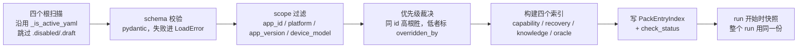

# Skill Pack 方案：可插拔扩展 + 控制台交互 + 调试闭环

> 前置文档：[分层方案](plan-device-recovery-and-app-knowledge.md)（做什么）· [利弊与业界对照](plan-review-and-industry-comparison.md)（为什么这么做）。
> **本文解决前两篇的共同缺陷**：所有机制最后都落在"改 Python"，没有说清**谁提供、怎么显示、怎么交互、怎么调试改进**。
> 目标状态：**新增一条系统处置、一条业务判据、一个断言类目、一条恢复动作，都不需要改代码、不需要发版。**

---

## 0. 现状盘点：哪些"可插拔"是真的，哪些是假的

| 扩展点 | 现状 | 改一次要动什么 | 可插拔？ |
|---|---|---|---|
| 抽象能力 `abstract_caps` | `plugins/abstract_caps.yaml` | 改 YAML | ✅ 真 |
| 执行器声明 | `plugins/executors/*.yaml` | 改 YAML | ✅ 真（**声明**可插拔） |
| 能力 capability | `plugins/capabilities/*.yaml` | 改 YAML **+ 改 `adb_executor.py` 的 if-chain** | ❌ **假** |
| 系统弹窗/设备处置 | 分散在 `agent_executor.py` 与旧引擎（`tap_consent_agree_on_engine` 之类硬编码） | 改 Python + 发版 | ❌ 无 |
| 应用业务知识 | `config.json` → `testing.knowledge[]` 裸条目 | UI 能改，但**无 owner、无版本、无作用域、无生效闭环** | ⚠️ 半 |
| 断言类目 / 可测性 | 前文计划写死在 `assertion_catalog.py` | 改 Python + 发版 | ❌ 无 |
| prompt 铁律 | `prompts.py` 常量 | 改 Python + 发版 | ❌ 无 |

**最刺眼的一条**：`adb_executor.execute()` 是 `if cap == "launch_app" … return self._fail(…"AdbExecutor 不处理 capability=")` 的硬编码分发（`adb_executor.py:52-88`），而 capability YAML 里的 `low_level.shell` 模板**根本没有被执行**。所以"加个 YAML 就多一个能力"是假的 —— 这是本方案第一个要修的东西（§3.1）。

现有 loader 已经具备的（可直接复用，别重造）：单根目录发现、**mtime 热更新**、`.disabled/.draft/.bak` 跳过、逐文件 `LoadError` 上报前端、`requires_caps` 交叉校验、`source_path` 记录、`registry.reload()` / `health_summary()`。

缺的是：**多根 + 优先级**、**归属与生命周期元数据**、**除 capability 外的其它 kind**、**统计与调试闭环**。

---

## 1. 统一模型：一切扩展都是 Pack 里的 Entry

### 1.1 三层概念

```
Root（根）          ── 决定优先级与写入权限，四个根（§1.3）
  └─ Pack（包）     ── 一个目录 = 一个可整体启停/同步/评审的单元，有 owner 和 version
       └─ Entry（条）── 一个文件 = 一条可独立命中/统计/回滚的规则
```

**为什么 Entry 一条一个文件**：git diff 可读、评审到条、命中统计到条、回滚到条、冲突定位到条。这也是对前文"知识全部塞一张 DB 表"的修正 —— 见 §4.1。

### 1.2 四类 Entry（kind）

| kind | 回答什么问题 | 对应分层 | 谁提供（默认） |
|---|---|---|---|
| `capability` | **能做什么动作** | 执行底座 | 平台团队 |
| `recovery` | **系统/设备异常怎么处置** | L0 | 设备环境组 + 自动学习 |
| `knowledge` | **这个 app 的业务判据是什么** | L2 | 业务测试同学 + 文档学习 + 自动学习 |
| `oracle` | **这类东西能不能测、怎么判、多严** | L3 | 平台团队 + 业务扩展 |

四类共用同一套：目录发现 → schema 校验 → 优先级裁决 → 热更新 → 前端展示 → 命中统计 → 调试回放。**这是本方案的核心收益：一套机制维护四件事，而不是四套代码。**

### 1.3 四个根与优先级

```
优先级（高 → 低，同 id 高者胜，低者不加载并在 UI 标"被覆盖"）

1. 应用私有   <APP_DATA>/packs/apps/<app_id>/      业务测试同学，UI 可直接编辑
2. 团队共享   <APP_DATA>/packs/team/                设备/环境组，可从 git 仓库同步
3. 仓库内置   <repo>/plugins/                       平台团队，随版本发布，走 PR
4. 自动学习   <APP_DATA>/packs/learned/             系统写入，默认 draft，需人工确认
```

设计要点：

- **学习产出排最低**，所以人写的永远压过机器学的，不会被自动学习悄悄改掉行为；
- **仓库内置排第三**（不是第一）：这样现场遇到平台默认规则不适用时，团队/应用层能就地覆盖，不必等发版；
- `<APP_DATA>` = `server/core/database.APP_DATA_DIR`，与 `agent_traj`、`app_docs` 同级；
- 现有 `plugins/` 目录**语义不变**，只是从"唯一根"变成"第三优先级根"，`MINIORANGE_PLUGINS_ROOT` 继续有效。

### 1.4 Pack 目录结构

```
packs/apps/b5431352-.../zaowu-camera-generation/
├── pack.yaml              # 清单：owner / version / 适用范围 / lifecycle
├── README.md              # 给人看的说明（可选）
├── entries/
│   ├── gen-timing.yaml            # kind: knowledge
│   ├── gen-fail-toast.yaml        # kind: knowledge
│   └── style-thumb-defect.yaml    # kind: knowledge
└── samples/                        # 调试用样本（§6.2 dry-run 直接拿它跑）
    ├── loading-0pct.png
    └── gen-failed-dialog.png
```

`pack.yaml`：

```yaml
id: zaowu-camera-generation
display_name: 造物相机 · 生成链路
kind_hint: knowledge              # 该包主要装什么（仅用于 UI 分组）
version: 3                        # 包版本，人工递增；UI 显示变更
provider: app_qa                  # platform | device_team | app_qa | learned | doc | third_party
owner: "@changpengcheng"          # 责任人，必填，UI 直接显示
lifecycle: active                 # draft | review | active | deprecated

scope:
  app_ids: ["b5431352-e34a-4d53-9e5b-33d5b130f0ff"]
  platforms: [android]
  app_versions: ">=2.0.0 <3.0.0"  # 被测应用版本范围；越界自动降置信并进复核队列
  device_models: []               # 空=不限

review:
  required: false                 # provider=learned/doc/third_party 时强制 true
  approved_by: ""
  approved_at: ""
```

### 1.5 Entry 通用字段

所有 kind 共用的头部，差异只在 `spec`：

```yaml
id: gen-timing                    # 包内唯一；全局 id = <pack_id>/<entry_id>
kind: knowledge
title: 生成链路耗时基线
enabled: true
provider: app_qa                  # 可覆盖 pack 默认
owner: "@changpengcheng"
lifecycle: active

when: "生成加载页出现『脑洞正在加载中 N%』"     # 触发条件，自然语言 + 可选结构化匹配
match:                            # 结构化匹配（可选，用于代码预筛，省 LLM）
  screen_text_any: ["脑洞正在加载中", "正在加载中"]
  scope_hint: "生成展示页"

spec:                             # ← 各 kind 自己的结构，见 §2
  ...

evidence:                         # 凭什么这么说，必填（无 evidence 的条目 check 会报警）
  - "cr-898b203890ac / CAM-GEN-013：进度 0% 停滞 50s 后放弃"
  - "cr-4a4f141c8f6c / CAM-VIEW-006：同现象"
source:
  type: manual                    # manual | doc | learned | demo | trace
  url: ""
  run_id: ""
confidence: 0.8                   # learned 来源不许自评，由命中统计推算（§6.4）
rollout: active                   # active | canary（灰度，§6.5）
expires_at: ""
```

**`provider` 与 `owner` 是必填的**，这是"谁提供的"这个问题的答案落到数据上：前端每一行都显示 provider 徽章 + owner 头像，点 owner 直接 @ 他。

---

## 2. 四类 Entry 的 spec 各长什么样

### 2.1 `capability` —— 能做什么动作（已有形态，只补元数据）

沿用现有 `plugins/capabilities/*.yaml` 结构，加 §1.5 的头部字段 + 一个新字段 `visible_to`：

```yaml
kind: capability
id: probe_device_state
spec:
  display_name: 读取设备运行态
  event_kind: probe_device_state
  category: system
  visible_to: [system]            # system | case | both（缺省 both）→ 决定进哪个 prompt 菜单
  platforms: [android]
  implementations:
    - id: adb_dumpsys_batch
      executor: adb
      requires_caps: [read_system_data]
      low_level:
        kind: shell_batch          # ← §3.1 的通用执行契约，不再需要 Python 分支
        commands:
          - name: power
            shell: "dumpsys power | grep -E 'mWakefulness|Display Power'"
          - name: keyguard
            shell: "dumpsys window | grep -E 'mDreamingLockscreen|mShowingLockscreen'"
          - name: foreground
            shell: "dumpsys activity activities | grep mResumedActivity"
        parse: keyvalue_lines       # 内置解析器名
      cost: 1
```

### 2.2 `recovery` —— 系统状况怎么处置（L0，跨 app）

这类 entry 有两种形态，**同一个 schema 支持"确定性快路径"和"交给模型"**：

```yaml
kind: recovery
id: miui-usb-debug-authorize
title: 小米 USB 调试授权框
provider: device_team
owner: "@device-team"

when: "顶层窗口是系统包且屏上出现『允许 USB 调试』"
match:
  top_window_pkg_prefix: ["com.android.systemui", "com.miui."]
  screen_text_any: ["允许 USB 调试", "USB debugging"]

spec:
  mode: deterministic             # deterministic | advise
  # deterministic：命中即按 actions 执行，不问模型（省钱，高置信才允许）
  actions:
    - capability: tap_element
      target: {text: "一律允许"}   # 锚点优先（见 §3.2）
      fallback_xy: [500, 620]
    - capability: wait_ms
      params: {ms: 800}
  verify:                         # 执行后如何确认恢复
    screen_text_none: ["允许 USB 调试"]
  forbid:                         # 安全护栏：这些永远不许点
    text_any: ["拒绝", "不允许", "退出登录", "清除数据"]
  max_attempts: 1
```

`mode: advise` 形态 —— 不给动作，只给模型一句提示（长尾场景用）：

```yaml
spec:
  mode: advise
  prompt_snippet: |
    这是系统更新提示，不是被测应用界面。选择「以后再说」「稍后」类按钮跳过，
    禁止点「立即更新」（会导致设备长时间不可用）。
```

> `prompt_snippet` 是关键设计：**改模型行为不必改 `prompts.py`**。铁律与经验都能从 pack 注入。

### 2.3 `knowledge` —— 业务判据（L2，按 app）

```yaml
kind: knowledge
id: gen-timing
spec:
  category: timing                # timing|blocking_ui|term|flow|constraint|known_defect|env_probe
  assert_kinds: [process_state]    # 关联的 oracle 类目 → 支持按类目定向召回
  then: |
    正常 60~180s 完成三路生成。进度条 60s 内无变化即判生成链路异常：
    停止等待，写 env_fact generation_pipeline=down，结束本条用例。
  hint_priority: always            # always=常驻 prompt | on_demand=只进目录按需读（§4.3）
```

已知缺陷类多一个字段，直接连到缺陷单，并强制"仍验证一次"（回应自愈掩盖问题）：

```yaml
kind: knowledge
id: style-thumb-defect
spec:
  category: known_defect
  assert_kinds: [ui_style_state, nav_reach]
  then: "点击仍在加载中的风格缩略图无响应，主图与选中态均不变。命中即结束，不要重复点击。"
  defect_ticket: "BUG-XXXX"
  reverify: true                   # 即使命中也先验证一次，防止缺陷已修复却永远跳过
  hint_priority: always
```

### 2.4 `oracle` —— 能测什么（L3 类目，覆盖度表自动生成）

**这是把 §5.2 那张手维护的表变成数据**：

```yaml
kind: oracle
id: ui_layout
title: 布局 / 位置 / 列数 / 顺序
provider: platform
owner: "@platform"

spec:
  status: supported                # supported | partial | unsupported
  method: [vlm_single, baseline_layout]   # 判定手段，按优先级
  strength_default: layout         # strict | layout | ignore_colors | pattern
  examples: ["社区列表双列布局", "主图下方四视图入口齐全"]
  preconditions: []                # partial 时写清前提
  gap: ""                          # unsupported 时写清缺什么
  unlock: ""                       # 解锁需要的工程改动
  unlock_ref: ""                   # 关联工程项 ID，用于收益预测
```

不可测类目示例（覆盖度页的"缺口归因"与"收益预测"全靠这两个字段自动算）：

```yaml
kind: oracle
id: hardware_input
spec:
  status: unsupported
  gap: "只能点快门，拍到什么不可控"
  unlock: "注入受控图源（相册预置图 / 虚拟相机 / content:// mock）"
  unlock_ref: "ENG-controlled-camera"
```

> 效果：解锁一项能力时，改的是**一行 YAML**（`status: unsupported → supported`），覆盖度快照与收益预测自动更新，彻底消掉前文 §3.12「类目表滞后于实现」这条风险。

---

## 3. 让「加 YAML 就生效」成真：已落地的四件事

### 3.1 通用 `low_level` 执行契约（否则 capability 永远要写 Python）✅ 已实现

现状：`adb_executor.execute()` 是硬编码 if-chain（`adb_executor.py:52-88`），YAML 里的 `low_level` 从未被执行。

改法：给每个 executor 加**一条兜底分支**，把 `ctx.selected_impl["low_level"]` 按声明的 `kind` 执行。router 已经把实现塞进 `ctx.selected_impl`（`router.py:150`），所以数据链路是通的。

```python
# adb_executor.execute() 末尾，替换现在的 return self._fail(...)
impl = (ctx.selected_impl or {})
low = impl.get("low_level") or {}
if low:
    return self._run_low_level(low, event, ctx, serial, started_at, t0)
return self._fail(event, started_at, t0, f"cap={cap} 无 Python 分支且未声明 low_level")
```

支持的 `low_level.kind`（一次实现，后续全靠声明）：

| kind | 用途 | 契约 |
|---|---|---|
| `shell` | 单条 shell | `shell: "getprop {prop}"` + `parse` + `allow_rc` |
| `shell_batch` | 一次取多个状态（取证用） | `commands: [{name, shell, parse, allow_rc}]` → `raw_response.low_level` 按 name 聚合；**部分失败仍返回可用事实** |
| `shell_seq` | 有序多步（设备预置用） | `steps: [{shell, name, parse, expect_rc}]`，任一步 rc 不符即停并 FAIL |

`parse` 可选：`raw`（默认）/ `lines` / `keyvalue_lines`（dumpsys 风格，一行多对全取）/ `first_token`。

`allow_rc` 是实测补上的：取证类命令的非 0 常常**是事实而不是错误** —— `pidof` 找不到进程给 rc=1、
`grep -c` 计数为 0 也给 1。声明 `allow_rc: [0, 1]` 即按正常结果处理。

**安全边界（必须做，第三方 pack 会走这条路）**：

- 模板参数只允许 `[A-Za-z0-9_.:/@%-]`，命中即拒绝并记 `LoadError`；
- 命令首词白名单：`input / dumpsys / am / pm / settings / getprop / svc / cmd / locksettings / appops / logcat / pidof / wm`；
- 显式黑名单：`rm / dd / reboot / mount / su -c / sh -c / >` 重定向；
- `provider: third_party` 的 pack **禁止** `low_level`（只能 `mode: advise` 或复用已有 capability）；
- 每条执行落 trace 的 `raw_response.cmd`，可回放审计。

**落地位置**：`server/services/regression/executors/low_level.py`（契约与闸门）+
`adb_executor.py` if-chain 末尾的 `_run_declared_low_level()` 兜底 +
`AdbExecutor.supports()` 改为「硬编码集合 ∪ 声明了 adb low_level 的能力」——
所以新增能力不必回来改 `_SUPPORTED_CAPS`。

**验收**：`plugins/capabilities/probe_device_state.yaml` 是一个**零 Python 代码**的能力，
在真机（`5fda2f6d` / Android 16）上一次批量取回 6 项证据：

```
status=pass  采集 6/6 项  555ms
  power     {mWakefulness: Awake, mHoldingDisplaySuspendBlocker: true}
  keyguard  {isKeyguardShowing: false, mDreamingLockscreen: false, mKeyguardOccluded: false}
  foreground[topResumedActivity=... com.mathmagic.i18n.builda/.MainActivity]
  target_pid''            ← 进程未运行（allow_rc 使其成为事实而非错误）
  anr_window'0'
  ime       {mInputShown: false}
```

回归脚本：`.venv/bin/python scripts/verify_low_level.py <sn>`（33 项，含闸门、解析器、
三种 kind、allow_rc、可见域过滤、真机取证；不带 sn 则只跑离线部分，可进 CI）。

### 3.2 决策输出改「锚点优先」（否则 recovery/knowledge 无法复用）✅ 已实现

`recovery.spec.actions[].target: {text: "一律允许"}` 这种写法要能落地，前提是执行侧支持按锚点定位。这也正是[评审文档 R17](plan-review-and-industry-comparison.md) 那条：现在模型每步直出绝对坐标，同一个按钮出七种坐标，导致规则无法复用、震荡检测失效。

改法（`prompts.py` + `router`）：

```json
"action": {"capability_id": "tap_element",
           "target": {"resource_id": "...", "text": "...", "content_desc": "..."},
           "fallback_xy": [x, y]}
```

定位顺序：`resource_id` → `text` 精确 → `text` 包含 → `content_desc` → `fallback_xy`。

> ⚠️ **实施时核到的事实修正**：`hierarchy_text` 在 `prompts.py:930` / `planner.py:923` 只是**形参**，
> agent 路径**从来没有传过值**，所以 prompt 里实际上没有 UI 层级。前两篇文档说的「锚点几乎免费」不成立。

**层级来源换过一次，成本差 60 倍**。起初用 `adb shell uiautomator dump`：实测 **2.2s**，
而且**在动画页面上直接失败** —— `ERROR: could not get idle state.`（它死等 idle，而造物相机
社区页卡片一直在动，三次全失败）。改用 `uiautomator2`（**依赖早已在 requirements，
`driver/tentacle/engine/mobile/mAdb.py` 也早就用它注入触控**）后：

| 来源 | 首次 | 复用连接 | 动画页面 |
|---|---|---|---|
| `uiautomator2`（主） | 817ms | **35~60ms** | ✅ 正常 |
| `adb exec-out uiautomator dump`（兜底 1） | 2.2s | 2.2s | ❌ 直接失败 |
| `adb shell` 落盘再 cat（兜底 2） | 2.2s | 2.2s | ❌ 直接失败 |

于是设计是：

| 阶段 | 做法 | 成本 |
|---|---|---|
| **决策时** | 不注入层级。模型看截图就能读出按钮文案，直接写 `target: {text: "社区"}` | 0 |
| **执行时** | 带锚点的动作 dump 一次并解析成精确坐标，按 serial 做 1.5s TTL 缓存 | +35ms（复用后） |
| **兜底** | 解析失败自动回落模型给的 x/y，并在 `raw_response.anchor` 记原因 | 0 |

（35ms 意味着"每步都取层级、甚至注入 prompt"重新变得可行 —— 留作后续选项，当前仍只在执行时取。）

**落地位置**：`server/services/regression/hierarchy.py`（采集 + 解析 + 紧凑视图）·
`adb_executor._point_for()`（tap / long_press / input_text 统一取点）·
`router._needs_locate()`（带锚点时跳过 VLM locate）·
`prompts.py` 铁律新增「锚点优先、坐标兜底」。

**候选挑选规则是踩坑改出来的**：初版按「面积最小=最具体」挑选，实测 `content_desc="社区"`
同时命中**不可点击的顶部标题**（121,220，面积 5586）和**可点击的底栏 Tab**（233,2494，面积 45804），
按面积挑会选中标题 —— 点下去毫无效果，正是「点击成功但界面无变化」那类假动作的来源。
现在改为**先按可点击性分层**（自身或最近可点击祖先），同层内再取面积最小。

**验收**（`scripts/verify_anchors.py <sn>`，30 项，含真实层级片段回归 + 真机端到端）：

```
锚点三次落点完全一致: [(967,2494), (967,2494), (967,2494)]
  ← 对比历史 VIEW-007 同一按钮七种坐标 455,2094 / 450,2081 / 462,2094 / 456,2086 …
选中的是可点击元素: True     未命中时回落坐标: pass     纯坐标老形态不受影响: pass
```

**两条已知边界**（写清楚，不夸大）：

1. **只在应用暴露语义时有效**。造物相机是 Flutter 类应用，`text` 与 `resource-id` 全为空，
   只有 `content-desc` 可用；纯图标控件（如底栏中间的「开始造物」）连 desc 都没有，
   仍然只能用坐标。锚点是**尽力而为的增强**，不是替代。
2. ~~震荡检测只修好了一半~~ → **已补齐**：见下方 §3.3。

---

### 3.3 震荡检测：落点容差 + 感知哈希 ✅ 已实现

原判定要求连续 3 步「capability + `str(params)` + 整图 sha1」三者全等，两个条件都过严，
实测只能抓纯黑屏。改造后：

| | 原来 | 现在 |
|---|---|---|
| 动作 | `str(params)` 全等 | 非坐标参数全等 + **落点距离 ≤ `coord_tolerance_px`(48)** |
| 屏幕 | 整图 sha1 全等 | **dHash 汉明距离 ≤ `phash_max_distance`(6)**，且裁掉顶部 5%（状态栏时钟） |
| 未知 | — | 任一步 phash 取不到 → **不判定**（宁漏不误杀） |

**容差为什么不用网格量化**：我最初按文档写的 `坐标 // 24` 分桶，实测**失效** ——
那个数字是照「归一化 0-1000」估的，但 `_Step.params` 里存的是**绝对像素**
（换算在 `planner._parse_agent_decision` 就做完了）；1200px 宽屏上 24px 只占 2%，
而且硬分桶会把 455 与 456 这种跨桶邻居劈开（VIEW-007 八个坐标被劈成 4 个签名）。
改成按距离比较后，八次落点全部归一。

**真机标定（阈值 6 落在很宽的间隙里）**：

| 场景 | dHash 距离 | 判定 |
|---|---|---|
| 同一静态屏连拍 | 0 | 没变 |
| 列表到底后再上滑（**真·空操作**，像素平均差 0.00） | 0 | 没变 → 连续 3 次即判卡死 |
| 通知栏展开 / 收起 | 24 | 变了 |
| 切换底栏 Tab | 25 | 变了 |
| 真实滚动一屏 | 33 | 变了 |

验收：`scripts/verify_oscillation.py <sn>`（25 项，含用 VIEW-007 真实坐标序列做的回归 +
阈值边界 6/7 + 真机标定）。

### 3.4 `recovery` kind 端到端 ✅ 已实现

这是「新增一种系统状况的处置不必改 Python」的第一条完整验证。链路上**每一环都是声明**：

```
取证  probe_device_state          纯 YAML low_level（§3.1）
  ↓
匹配  plugins/recovery/*.yaml     evidence / top_window_pkg_prefix / screen_text_any（AND）
  ↓
处置  wake_screen                 纯 YAML low_level：input keyevent 224
      dismiss_keyguard            纯 YAML low_level：wm dismiss-keyguard
  ↓
复查  rule.verify                 再取一次证，不通过则按 max_attempts 重试
```

代码只保留两件事：**取证的字段规整**（`recovery.collect_evidence`，把 dumpsys 输出转成
`awake/locked/foreground_pkg/target_alive/anr` 等事实，含派生的 `screen_blocked`）与
**止损**（`max_attempts`、forbid 护栏）。

首批两条规则正好覆盖两种形态：

| 规则 | mode | 说明 |
|---|---|---|
| `screen_asleep_or_locked` | `deterministic` | 命中即执行 4 个动作并复查。**这条是被真实事故逼出来的**：设备过夜息屏后前台变成 `com.android.systemui`，锚点全部未命中、用例连续失败（`evidence_notes` 里记了这件事） |
| `system_permission_dialog` | `advise` | 只给 `prompt_snippet`（含「禁止点拒绝」），因为各家 ROM 文案与按钮顺序不同，硬编码枚举不完 |

**真机端到端**（`scripts/verify_recovery.py <sn>`，30 项）：人为 `keyevent 26` 熄屏 →
取证发现 `screen_blocked=yes` → 命中规则 → 执行 4 动作 → verify 通过 → 再取证已不命中。
安全护栏也验了：把 `tap_element target={text:"清除数据"}` 放进动作列表，被 `forbid` 拦下且只执行了后续安全动作。

**已接入 agent 主循环**（`agent_executor._maybe_recover`）。成本控制是关键设计：

| 环节 | 触发条件 | 额外设备调用 |
|---|---|---|
| 廉价预筛（代码） | 仅用**已经算出来的**画面统计与停滞计数：开场一次 / 画面全黑全白 / 连续 3 步屏幕几乎没变 | **0** |
| 取证 + 规则匹配 | 仅预筛命中时 | 1 次 `probe_device_state`（约 0.5s） |
| 止损（代码） | 单条用例恢复轮数 ≤3，用尽仍未恢复 → `device_unhealthy` | — |

`_screen_signal()` 把 phash 与「全黑/全白」合在**一次解码**里算出，所以正常屏每步开销不变。
恢复事件以 `capability_id="recovery_<规则 id>"` 落 trace、**不占业务决策预算**，并写一条
短期记忆告知业务 agent「刚发生过恢复，页面可能已重置」。`RunReport` 新增
`env_interventions` / `recovery_hits`。

> 与 §2.4 SystemAgent 的关系：`deterministic` 规则是**快路径**（命中就走，不烧 LLM）。
> `advise` 规则目前**只记录不消费**（按约定未做 prompt 注入），在回放页显示为「建议」标记。
> SystemAgent 本体（LLM 回路）仍未接。

验收：`scripts/verify_recovery_inloop.py <sn>`（30 项，含预筛边界、四种恢复分支、
恢复流程自身抛异常不拖垮用例，以及真机熄屏→主循环自愈）。

---

## 4. 运行期：加载、裁决、注入、统计

### 4.1 文件为准，DB 只做索引与统计

**这是对分层方案 §4.2「知识全部入库」的修正。**

| 关注点 | 落在哪 | 理由 |
|---|---|---|
| Entry 内容（真相） | **文件**（YAML） | git 可 diff、可评审、可回滚、可整包同步；单条编辑不会重写全量 |
| 索引 / 统计 / 审计 | **DB**（可随时从文件重建） | 命中计数、最近使用、审批记录、冲突快照需要并发写与查询 |
| 大体积附件 | 文件（`samples/`） | 截图证据不进库 |

```python
# server/models/pack_index.py —— 纯索引，删了能重建
class PackEntryIndex(Base):
    __tablename__ = "pack_entry_index"
    uid            = Column(String, primary_key=True)   # <root>/<pack_id>/<entry_id>
    root           = Column(String, index=True)         # app|team|builtin|learned
    pack_id        = Column(String, index=True)
    entry_id       = Column(String)
    kind           = Column(String, index=True)
    app_id         = Column(String, index=True, default="*")
    provider       = Column(String, index=True)
    owner          = Column(String)
    lifecycle      = Column(String, index=True)
    content_hash   = Column(String)                     # 变更检测 + 版本历史键
    overridden_by  = Column(String, default="")         # 被高优先级同 id 覆盖时填对方 uid
    # —— 统计（调试闭环的数据基础）
    hit_count      = Column(Integer, default=0)
    refuted_count  = Column(Integer, default=0)
    last_hit_run   = Column(String, default="")
    last_hit_at    = Column(DateTime, nullable=True)
    unused_days    = Column(Integer, default=0)         # 定时任务算
    check_status   = Column(String, default="ok")       # ok|schema_error|conflict|expired|no_evidence
    check_detail   = Column(Text, default="")
```

存量迁移：`config.json → testing.knowledge[]` 的 63 条一次性导出成 `packs/apps/<app_id>/legacy-imported/entries/*.yaml`（62 条落到对应 app，1 条「屏幕黑屏」落到 `packs/team/` 并转成 `recovery`），旧字段保留只读一个版本。

### 4.2 加载与裁决（扩展现有 loader，不重写）



关键约定：

- **生效时机 = run 边界**。沿用 loader 现有 mtime 探测，但 run 进行中**不换**快照（避免同一任务前后行为不一致）——这条与 OpenClaw 的"会话开始快照"一致；
- UI 改完显示「将在下一次任务生效」+ 一个「立即重载」按钮（调已有 `registry.reload()`）；
- 加载失败**不阻断**：坏条目进 `LoadError`（现有通道直通前端），其余照常生效。

### 4.3 注入策略：常驻 vs 目录按需

承接[评审 R8](plan-review-and-industry-comparison.md)（OpenClaw 的两级加载）：

| 类型 | 注入方式 | 预算 |
|---|---|---|
| `hint_priority: always`（`known_defect` / `timing` / 命中的 `recovery.advise`） | 正文常驻 prompt | 合计 ≤600 字 |
| `hint_priority: on_demand`（其余全部） | 只注入**目录行**：`uid ｜ kind ｜ scope ｜ when 一句话` | 每条 ≈24 token |
| 模型主动取用 | 新增 capability `read_knowledge`（`visible_to: [case, system]`），参数 `{uid}` | 一次工具往返 |

超预算时的**降级顺序**（抄 OpenClaw，写死在代码里）：先保 `uid + kind`，余额给缩短的 `when`，再不够丢 `when` 并输出一行「知识目录已截断，请跑 pack check」。

### 4.4 命中与推翻怎么记（调试闭环的数据来源）

| 事件 | 谁写 | 落到哪 |
|---|---|---|
| entry 被注入 | 引擎 | 该步 trace 的 `raw_response.packs_injected: [uid]` |
| 模型明确采纳（thought 引用了 uid，或按其结论收敛） | 引擎解析 | `hit_count += 1`，`last_hit_run` |
| 模型判定与屏幕冲突（thought 出现「知识与实况不符」） | 引擎解析 | `refuted_count += 1` |
| `refuted_count >= 2` | 定时任务 | `lifecycle → deprecated`，进 UI「待清理」 |

统计**异步批量回写**，不阻塞执行路径。

---

## 5. 前端：显示什么、在哪显示

前端在仓库外，走 REST（`{"code":200,"data":…}`）+ WS（`DeviceManager.broadcast_to_observers`，`agent_stream` 同款通道）。**尽量扩已有页面，只新增两个页面。**

### 5.1 页面地图

前端工程：`/Users/changpengcheng/code/MiniOrange`（Vue3 + Vite + element-plus）。

| 页面 | 新/改 | 作用 | 状态 |
|---|---|---|---|
| 设置 · **扩展**（`/settings/packs`） | **新** | 四 Tab 的 Pack 管理台。刻意**不改**老的 `/settings/skills`，避免动到 592 行的旧目录页 | ✅ `PacksPage.vue` + `PacksPanel.vue` |
| Entry 详情抽屉 | **新** | 内容 / 依据 / 命中记录 / 原始 YAML 四 Tab + 编辑·试跑·启停 | ✅ `PackEntryDrawer.vue` |
| 试跑对话框 | **新** | 选设备 → 只预演 / 真执行，展示命中理由、设备事实、计划动作（含被护栏拦下的） | ✅ `PackDryRunDialog.vue` |
| API 层 | **新** | 9 个薄封装，照 `settings.js` 的 `request({url, method})` 写法 | ✅ `src/api/packs.js` |
| 侧栏 + 路由 | **改** | 各加一行（`Settings/index.vue`、`router/index.js`） | ✅ 共 3 行改动 |
| 回放页「本步命中」栏 | **改** | 每步显示命中的 pack（已恢复/未恢复/建议），一键「去规则页」定位 | ✅ `ExecutionTimeline.vue`（消费 `phase=recovery` 事件 + 历史 trace 里 `recovery_*` 事件回填） |
| 待确认队列 | **新** | learned / doc 产出的 draft 过审 | 待做：目前没有学习写入，队列必然空 |
| 能力覆盖度 | **新** | 由 `oracle` entries 自动生成 | 待做：依赖 oracle kind |
| 应用详情 · 知识 Tab | **改** | 按约定**不迁移**存量 63 条，老 `KnowledgePanel.vue` 保持原样 | 不动 |

### 5.2 Skills 页（主控制台）

```
┌─ 设置 · Skills ─────────────────────────────────────────────────────────┐
│ ⚠ 3 个条目有问题：1 schema 错误 · 1 冲突 · 1 缺 evidence   [查看] [重载] │
├─────────────────────────────────────────────────────────────────────────┤
│ [能力 25] [恢复 12] [知识 68] [判定 19]        搜索▁▁▁  筛选: 全部根 ▾  │
├─────────────────────────────────────────────────────────────────────────┤
│ ✅ gen-timing            生成链路耗时基线                                │
│    知识·timing  [app_qa] @changpengcheng   造物相机 · v2.0~3.0           │
│    命中 17 / 推翻 0 · 3 天前用过 · 应用私有根                            │
│ ─────────────────────────────────────────────────────────────────────── │
│ ✅ miui-usb-debug        小米 USB 调试授权框                             │
│    恢复·确定性  [device_team] @device-team   全部应用 · Android          │
│    命中 42 / 推翻 1 · 今天用过 · 团队根                                  │
│ ─────────────────────────────────────────────────────────────────────── │
│ ⏸ style-thumb-defect    未完成缩略图点击无响应        BUG-XXXX           │
│    知识·known_defect  [learned] 待确认   造物相机                        │
│    ⚠ 学习产出，需确认后生效                        [去确认]              │
│ ─────────────────────────────────────────────────────────────────────── │
│ 🚫 wait-black-screen     黑屏时等待                                      │
│    知识  [app_qa]  已被 team/black-screen-recover 覆盖   [查看覆盖者]     │
└─────────────────────────────────────────────────────────────────────────┘
```

每行必须出现的四样东西，正是"谁提供、怎么维护"的答案：**provider 徽章 · owner · 作用域 · 命中/推翻计数**。

状态图标：`✅ active` / `⏸ draft 待确认` / `🚫 被覆盖或已停用` / `⚠️ 校验有问题` / `🧪 canary 灰度中`。

### 5.3 Entry 详情抽屉（点一行展开）

```
┌─ gen-timing · 生成链路耗时基线 ────────────────────── [编辑] [试跑] [⋯] ─┐
│ ① 概要   ② 内容   ③ 命中记录   ④ 变更历史   ⑤ 原始 YAML                 │
├─────────────────────────────────────────────────────────────────────────┤
│ ② 内容                                                                  │
│   触发 when   生成加载页出现「脑洞正在加载中 N%」                        │
│   匹配 match  screen_text_any: 脑洞正在加载中 / 正在加载中               │
│   结论 then   正常 60~180s；进度 60s 无变化 → 判链路异常，写 env_fact…   │
│   类目        process_state（判定·部分可测）→ 跳转能力覆盖度             │
│   证据        cr-898b203890ac/CAM-GEN-013  [看回放]                     │
│               cr-4a4f141c8f6c/CAM-VIEW-006 [看回放]                     │
│   注入        常驻（always）· 占 118 字                                  │
├─────────────────────────────────────────────────────────────────────────┤
│ ③ 命中记录  17 次采纳 / 0 次被推翻                                       │
│   cr-aaaa/CAM-GEN-013 第 9 步  采纳 → 提前结束   [跳到该步]              │
│   cr-bbbb/CAM-GEN-010 第 8 步  采纳            [跳到该步]               │
└─────────────────────────────────────────────────────────────────────────┘
```

**「跳到该步」直接落到 AgentRun 回放页对应步**，这条链路是整个调试体验的骨架：知识 → 影响了哪一步 → 那一步屏幕长什么样 → 结论对不对。

### 5.4 AgentRun 回放页扩展（调试入口）

现有页面已有逐步 thought / action / thumb（`agent_stream`）。右侧加一栏：

```
┌ 第 9 步  wait_ms 5000ms ────────────────────────────────────────────────┐
│ [截图]                    │ 本步注入的 Pack                             │
│                           │  ✅ gen-timing（常驻）→ 模型采纳            │
│                           │  · gen-fail-toast（目录，未取用）           │
│                           │  🧪 loading-stall-v2（灰度）→ 未命中        │
│ thought: 进度仍 0%，按     │ ─────────────────────────────────────────── │
│ 已知基线判定链路异常…      │ [基于本步新建知识]  [标记该知识有误]        │
└─────────────────────────────────────────────────────────────────────────┘
```

两个按钮就是**改进闭环的入口**：现场看到问题，当场建条目或纠错，带着 run_id + 截图证据自动填进草稿。

### 5.5 待确认队列（learned / doc 的把关口）

```
┌─ 待确认 (7) ───────────────────────────────── 全部采纳 ▾  批量拒绝 ────┐
│  3/7   style-thumb-defect        来源: learned · cr-898b203890ac        │
│  ┌──────────────┐  when  点击仍在加载中的风格缩略图                     │
│  │  [截图证据]  │  then  主图与选中态均不变，命中即结束                 │
│  │  第 4/7/10 步│  证据  连续 3 次断言失败，坐标落在缩略图正中           │
│  └──────────────┘  作用域 造物相机 · v2.0~3.0     置信 0.55             │
│                                                                         │
│  [采纳并启用]  [改一下再采纳]  [拒绝并记原因]  [看完整回放]              │
└─────────────────────────────────────────────────────────────────────────┘
```

一屏一条、证据在左、结论在右 —— 这是让"人工确认"真的能被执行的关键（[评审文档](plan-review-and-industry-comparison.md) 里 Healenium 的教训就是"报告脚注没人看"）。

### 5.6 能力覆盖度页（全自动生成）

```
┌─ 能力覆盖度 · 造物相机（72 条用例）────────── catalog v19 · 3 天前刷新 ─┐
│  ✅ 完全可测 41 (57%)   ⚠️ 部分 19 (26%)   ❌ 不可测 12 (17%)            │
│                                                                         │
│  缺口归因                          解锁后新增可测                        │
│  hardware_input      7 条   ← 注入受控图源            +7   [ENG-…]      │
│  env_construct       3 条   ← 多账号环境池            +3               │
│  data_consistency    1 条   ← 启用 call_api           +1，+4 升级       │
│  perf_timing         1 条   ← logcat/perfetto 采集    +1               │
└─────────────────────────────────────────────────────────────────────────┘
```

数据全部来自 `oracle` entries 的 `status / gap / unlock / unlock_ref` + 用例的 `assert_kind` 标注，**没有一行手维护的统计**。

---

## 6. 调试与改进闭环

六件事，缺一不可：

### 6.1 check（体检）

`GET /packs/check` → 逐条给 `check_status`：schema 错误、`id` 冲突与裁决结果、缺 `evidence`、缺 `owner`、`expires_at` 过期、`app_versions` 越界、`low_level` 违反白名单、`provider=learned` 却已 active 未审批。

UI：Skills 页顶部红条（复用现有 `LoadError` 通道）。CLI：`python -m server.tools.packs check`（对标 `openclaw skills check`），可进 CI。

### 6.2 dry-run（单条试跑）

选一条 entry → 选数据源 → 立刻看结果，**不用跑整条用例**：

| 数据源 | 说明 |
|---|---|
| 当前设备当前屏 | 最快，改完立刻验 |
| `samples/` 里的截图 | 可重复，适合固化回归 |
| 历史 trace 的某一步 | 复现当时现场 |

输出：**是否命中**（match 命中了哪个条件）→ **会做什么**（recovery 的 actions 逐条列出，标注是否被 `forbid` 拦下）→ **注入什么**（knowledge 实际拼出的 prompt 片段与字数）。默认**只预演不执行**，需显式勾选「真的在设备上执行」。

### 6.3 replay（批量回放，改前先看影响面）

选一批历史 run（或某 app 全部）→ 用**新的 pack 快照**重跑注入与匹配逻辑（不上设备、不调业务决策）→ 输出 diff：

```
回放 12 个 run / 143 步 · 对比 baseline: 昨天 18:00 快照
  新增命中   +23 步   gen-timing 在 GEN-010/011/013 各命中 2~4 次
  丢失命中    -2 步   style-thumb-defect 因 app_versions 收窄不再命中
  预算变化   常驻块 118 → 236 字（+100%）⚠ 接近 600 字上限
  结论可能改变的用例: CAM-GEN-013（原 goal_unreachable → 预计 app_defect）
```

这是[评审文档](plan-review-and-industry-comparison.md) §3.10「参数调不动」的落地形态：`m_case_run_trace` 已经存了每步 thumb + 动作 + reasoning，回放不需要新采集数据。**任何 pack 变更在合并前都要跑一次 replay。**

### 6.4 measure（统计与归因）

每条 entry 常显 `hit / refuted / last_hit / unused_days`。**`confidence` 不许人或模型自评**，由 `hit/(hit+refuted)` 推算并按样本量收缩（样本 <5 时压在 0.6 以下）——这条直接回答 Healenium「0.87 解释不了为什么」的问题。

### 6.5 canary（灰度）

`rollout: canary` + `canary_scope: {app_ids / case_ids / device_models}`：只在指定范围生效，UI 标 🧪。满足「命中 ≥10 次且 refuted = 0」后按钮变为可转 active。风险大的 `recovery.deterministic` 建议强制先灰度。

### 6.6 版本与回滚

每次保存按 `content_hash` 存一份快照到 DB（只存 entry 文本，很小）。详情抽屉「变更历史」Tab 支持 diff 与一键回滚。整包可 `version` 递增并打 tag，团队根支持从 git 仓库拉取指定 tag。

### 6.7 退役

定时任务每天算 `unused_days`；`unused_days > 90` 或 `refuted_count >= 2` → 进「待清理」，UI 批量 `deprecated`（**不删文件**，保留可追溯）。

---

## 7. API 清单

沿用现有约定（`{"code":200,"data":…}`，挂 `rSettings.py` 或新建 `rPacks.py`）。

实现位置：`server/routers/rPacks.py`（已注册进 `main.py`）。

| 方法 | 路径 | 用途 | 状态 |
|---|---|---|---|
| GET | `/packs` | 列表（筛 `kind/q/provider/lifecycle/root/app_id`），返回 §5.2 需要的全部字段；`?fixture=1` 给样例数据 | ✅ |
| GET | `/packs/kinds` | 四类 Tab 元数据：中文名 / 条目数 / 是否就绪 / 未就绪原因 | ✅ |
| GET | `/packs/{uid}` | 详情（含 spec + 原始 YAML 全文） | ✅ |
| PUT | `/packs/{uid}` | 保存整份 YAML：**先校验后落盘**，原子写，不过则 400 | ✅ |
| POST | `/packs/{uid}/lifecycle` | 启停 / 改生命周期，逐行改字段以**保留注释** | ✅ |
| POST | `/packs/{uid}/dry-run` | 试跑：`execute=0` 只预演（是否命中 → 会做什么 → 注入什么），`=1` 真执行 | ✅ source=device |
| GET | `/packs/health` · POST `/packs/reload` | 加载健康度 / 立即重载 | ✅ |
| POST | `/packs` | 新建条目 | 待做（S1b 多根后再开，否则不知该落哪个根） |
| GET | `/packs/check` | 体检（§6.1） | 待做（现由 `/packs/health` 覆盖一部分） |
| POST | `/packs/replay` | 批量回放 diff（§6.3） | 待做 |
| GET | `/packs/drafts` · POST `/packs/from-failure` | 待确认队列 / 从失败现场建草稿 | 待做（依赖学习写入） |
| GET | `/coverage/{app_id}` | 覆盖度快照 | 待做（依赖 oracle kind） |
| GET | `/settings/skills` | **保留未动**，老 Skills 页零改动 | ✅ |

dry-run 的 `source=sample|trace_step` 暂未开放：样本图需要 OCR、trace 步骤需要 trace 里存证据快照，两者都还没有。接口会明确返回 400 说明原因，而不是假装支持。

WS 事件（复用 observer 通道）：`pack_check_done` · `pack_replay_progress` · `pack_hit`（AgentRun 页实时高亮本步命中）。

---

## 8. 责任矩阵：谁提供、谁维护、怎么把关

| provider | 提供什么 | 落在哪个根 | 怎么改 | 把关 | 失效策略 |
|---|---|---|---|---|---|
| `platform` 平台团队 | `capability`、`oracle` 类目、prompt 骨架 | 仓库内置 | Git PR + 发版 | 代码评审 + CI 跑 `packs check` | 随版本 |
| `device_team` 设备环境组 | `recovery`（跨 app 系统处置）、设备预置项 | 团队共享 | UI 或 git 同步 | 需 1 人 review；`deterministic` 必须先灰度 | 命中统计 + 季度复核 |
| `app_qa` 业务测试同学 | `knowledge`（业务判据、已知缺陷、术语） | 应用私有 | UI 表单 / 失败现场一键建 | 自审 + owner 必填 | `app_versions` 越界自动降置信 |
| `doc` 文档学习 | 从需求文档抽的 `knowledge` | 学习根 | 自动生成 | **强制**进待确认队列，默认 `draft` | 文档 hash 变化触发重抽 |
| `learned` 遇阻学习 | `knowledge` / `recovery` | 学习根 | 自动生成 | **强制**待确认；confidence 由统计推算 | `refuted>=2` 自动 deprecate |
| `third_party` 外部 | 仅 `advise` 类 recovery | 团队共享 | 手动导入 | **禁止 `low_level`**；必须人工读过 | 默认 90 天过期 |

### 8.1 仍然需要写代码的部分（诚实边界）

| 仍需写代码 | 为什么 | 频率 |
|---|---|---|
| Executor 通道实现（adb/remote/ios_wda 的进程与协议） | 涉及外部依赖与连接管理 | 极低 |
| `low_level.kind` 新增一种执行契约 | 一次实现，之后全靠声明 | 极低（预计 3 种够用很久） |
| Pack runtime（loader 多根、裁决、注入、统计） | 平台底座 | 一次性 |
| LLM 调用与解析层 | 平台底座 | 一次性 |

**变更频率最高的四类（系统处置、业务判据、断言类目、恢复动作）全部落在 YAML，不需要写代码、不需要发版。** 这是本方案要达成的唯一验收标准。

---

## 9. 分期

| 期 | 内容 | 验收 |
|---|---|---|
| **S0a** ✅ 已完成 | §3.1 通用 `low_level`（三种 kind + 白名单 + parser + allow_rc）+ `visible_to` 可见域过滤 | 达成：`probe_device_state` **零 Python 代码**在真机跑通 6/6 取证；33 项回归脚本全通过；既有能力与 `/settings/skills` 无回归 |
| **S0b** ✅ 已完成 | §3.2 锚点定位：层级采集器 + 优先级解析（可点击优先）+ 执行侧解析 + router 让路 + prompt 铁律 | 达成：同一锚点三次落点完全一致；30 项回归脚本全通过（含用真实层级片段固化的「点中标题」回归）；老的纯坐标形态与 S0a 均无回归 |
| **P0** ✅ 已完成 | §3.3 震荡检测（落点容差 + 感知哈希） | 达成：VIEW-007 八种坐标归一；真机标定同屏 0 / 变化 24~33，阈值 6 有宽间隙；25 项回归通过 |
| **S1a** ✅ 已完成 | §3.4 `recovery` kind：loader 加载 `plugins/recovery/` + 规则 schema（provider/owner/lifecycle/priority）+ 匹配 + 确定性执行 + forbid 护栏 + verify | 达成：熄屏→自动恢复端到端跑通，全链路零新增 Python 判断逻辑；30 项回归通过 |
| **S1b** 待做 | 多根 loader + `pack.yaml` + `PackEntryIndex` + 存量 63 条知识迁移 | 四个根都能加载；同 id 裁决正确并在 API 里返回 `overridden_by` |
| **S2a** ✅ 已完成 | `/packs` 读写 + dry-run API + 前端「扩展」页（四 Tab / 详情抽屉 / 试跑弹窗） | 达成：能在 UI 看四类条目（含 provider/owner/作用域/状态）、改 YAML（校验不过不落盘、注释不丢）、启停、对真机试跑；63 项 API 回归通过 |
| **S2b** ✅ 已完成 | L0 恢复接入主循环（预筛 + 止损 + 事件上报）+ 回放页「本步命中」栏 | 达成：真机熄屏后主循环自愈，恢复事件不占业务预算、可在回放页溯源到规则；30 项回归通过 |
| **S2c** 待做 | 新建条目 + 批量回放 + 待确认队列 + 覆盖度页 | 分别依赖 S1b 多根、trace 证据快照、学习写入、oracle kind |
| **S3** | check + dry-run + AgentRun 页命中栏 | 改一条 entry 到验证结果 **≤1 分钟**（当前：跑一整包 55 分钟） |
| **S4** | replay diff + 待确认队列 + canary + 版本回滚 | 每次 pack 变更能给出影响面报告；learned 条目 100% 经人工确认 |
| **S5** | oracle kind + 覆盖度页 | 覆盖度表 **零手维护**，改 `status` 一行即刷新收益预测 |

S0 是所有后续的前提 —— 不做它，"可插拔"永远是假的。

---

## 附：一句话结论

> **变更频率最高的四件事（系统处置、业务判据、断言类目、恢复动作）必须是数据不是代码；每条数据必须写明 provider 与 owner；每条数据必须能一分钟内试跑、能看到命中记录、能在合并前看到影响面。**
> 前两篇方案缺的正是后半句：机制设计得再对，只要改一次要发一次版、改完不知道影响谁，就没人会维护它。

