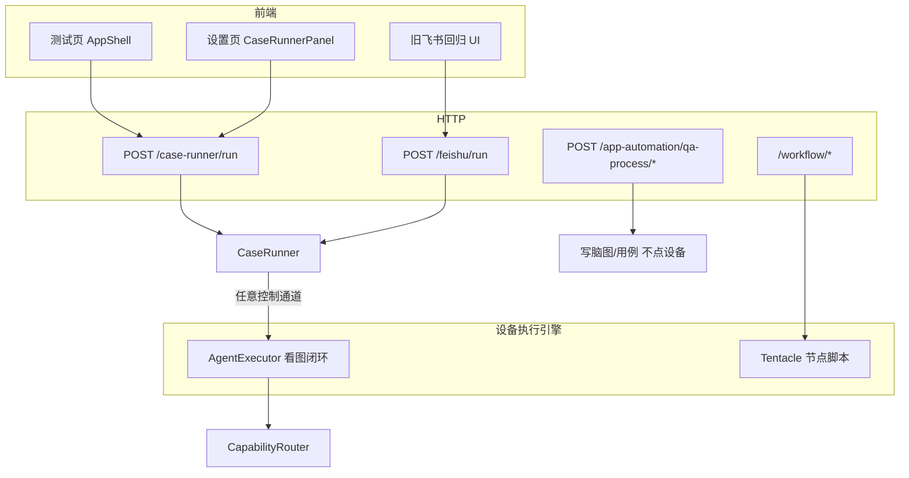
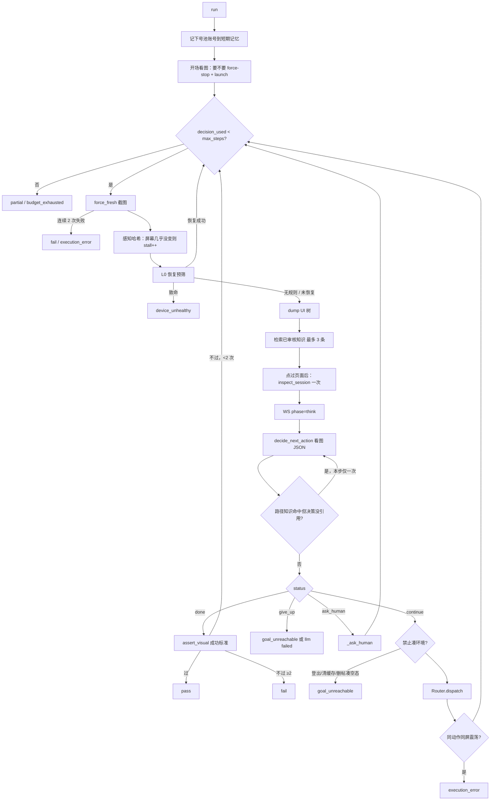

# 后端执行逻辑（对照源码）

本文描述 **2026-08-27 起** 设备执行链路：测试平台下发任务只走 **CaseRunner → Agent**。旧 Plan 循环与 Copilot 批次跑用例已停用。

| 文档 | 对应什么 | 是否仍是主路径 |
|------|----------|----------------|
| **本文** | 测试平台「下发任务」→ CaseRunner → Agent | **是。前端 `AppShell.vue` 只打 `/case-runner/run`** |
| [8月27日-执行策略后续改动.md](../8月27日-执行策略后续改动.md) | 预防 / 知识索引 / 登录闸门 / 对话改 Agent | **2/4/6 + Copilot 已落地**；轨迹 Hint、断言分级未动 |
| [prd_llm_agent_execution.md](prd_llm_agent_execution.md) | Agent 改造方案（D1–D6） | 历史设计稿 |
| [regression/execution-flow.md](../regression/execution-flow.md) | 旧飞书 Copilot 逐步点击 | **批次入口已转发到 CaseRunner**；对话小窗也改为 `run_cases(instruction)` |

---

## 0. 先建立心智模型

后端「执行」不是一个函数，而是 **四层套娃**：

```
① 任务编排     CaseRunner：多设备、多用例、闸门、落库、WS
② 单用例引擎   AgentExecutor（看图闭环；adb / remote / ios_wda）
③ 动作分发     CapabilityRouter：选通道、可选 locate、调 executor
④ 真机动作     adb / remote / ios_wda / vlm / hitl / ai_persona / internal
```

再加上三条旁路，它们 **不是** 用例逐步点击，但会改执行上下文：

| 旁路 | 干什么 | 入口 |
|------|--------|------|
| QA 流程 | 读需求、写脑图、生成 `draft_cases` | `POST /app-automation/qa-process/tick/{app_id}` |
| 知识捕获 | 跑完后草稿知识，审核后才注入 Agent | `knowledge_capture_service` |
| 号池 | 开跑前挑测试账号，写进 prompt | `account_issue_service.bind_account_for_case` |

**当前测试页下发的，永远是 ① + ②，且 ② 只有 Agent。** `execution_mode` 请求字段已忽略。

---

## 1. 仓库里有几条「执行」



读日志时用这些标签区分路径：

| 日志 TAG | 路径 |
|----------|------|
| `CaseRunner` | 任务编排 |
| `AgentExecutor` | 看图闭环 |
| `CapabilityRouter` | 动作分发 |
| `AdbExecutor` / `RemoteExecutor` / … | 真机 |
| `Recovery` | L0 系统恢复 |

---

## 2. HTTP 入口与进程挂载

FastAPI 在 `main.py` 挂路由。和「跑用例」直接相关的是：

| 前缀 | 文件 | 作用 |
|------|------|------|
| `/case-runner` | `server/routers/rCaseRunner.py` | **主入口**：启动、取消、重跑、任务列表、trace、HITL 相关查询 |
| `/hitl` | `server/routers/rHitl.py` | 人工回复 / 跳过 / 未决请求 |
| `/feishu` | `server/routers/rFeishuRegression.py` | 飞书表配置、**旧 Copilot 跑法** `POST /feishu/run` |
| `/app-automation` | `server/routers/rAppAutomation.py` | 应用配置、playbook、QA 流程、用例列表 |
| WebSocket | `server/websocket/` | 设备通道、HITL 广播、`testing_task` / `agent_step` |

`POST /case-runner/run` 在真正开跑前做三道闸：

1. App 必须存在。
2. 名单里任一 `sn` 已有 running 任务 → **409 device busy**（`task_store.busy_task_for_sn`）。
3. 落在别人排期窗口内 → **409 device reserved**（`qa_process_lock.blocking_reservation`）。本窗口主人（同 `slot_id` 或同 requirement/release + `run_type`）可以下发。

请求体关键字段（`RunRequest`）：

```
app_id, sn / sns, coverage=once|per_device,
platform, case_ids, execution_mode=auto|agent|plan,
run_type=manual|feishu|schedule,
slot_id / requirement_id / release_id
```

前端测试页：`src/views/Testing/AppShell.vue` → `runCaseRunner()` → `src/api/caseRunner.js`。

---

## 3. 用例从哪来

**执行不再读飞书缓存。** `app_automation_service.list_app_cases()` 只返回 QA 流程里的 `draft_cases`：

```
App.automation_config.qa_process.requirements[].draft_cases[]
```

每条草稿被规范成：`case_id / name / precondition / steps[] / expected[] / steps_raw / expected_raw / module / platform`。

`case_runner.to_case_spec()` 再变成规划器吃的 `CaseSpec`：

- 步骤：`case_text_semantic_service.split_case_field` + `parse_numbered_items_rules`
- 预期：优先 `expected_by_step[step_num]`，否则按下标对齐
- 前置：原文 + `[meta] app_id | app_name | env_profile | package`

飞书表仍可通过 `POST /feishu/fetch/{app_id}` 拉数据，但那是导入/对照用途；**下发任务用的是流程草稿**。

---

## 4. 任务生命周期（CaseRunner）

入口：`case_runner.run_cases()`。

### 4.1 建任务

1. 解析设备列表；`coverage` 缺省或单机 → `once`。
2. `list_app_cases` 过滤 `case_ids`。
3. 按设备查平台（`MDevice` → `device_platform_kind`），解析 Android/iOS 包名。
4. `playbook_service.ensure_playbook(app)`：把应用说明书快照进任务（**本趟不再按包名读仓库 YAML**）。
5. 生成 `run_id = cr-{12 hex}`。
6. 按 coverage 展开执行单元（见下）。
7. 写入内存 `_RUNS`，`persist_run_start` 落到 `app_regression_runs`。
8. WS：`testing_task` / `task_created`。
9. `resolve_regression_provider()`：密钥配置里 **可用 + 用途=用例** 的那条大模型。没有 → 整任务失败。
10. 每台设备一条 daemon 线程：`_execute` → `device_scope(sn)` → `_execute_on_device`。

`run_id`（任务）和单条用例的 `report_run_id` 不是同一个：

| coverage | report_run_id |
|----------|----------------|
| `once` | `{task_id}::{case_id}` |
| `per_device` | `{task_id}::{case_id}::{sn}` |

Agent 流式事件、trace 主键用的是 **report_run_id**。

### 4.2 coverage

| 值 | 行为 |
|----|------|
| `once`（拆分） | 用例池共享。设备抢 `status=pending` 且尚未绑 sn 的行 |
| `per_device`（全机） | 笛卡尔积：每台设备各跑完整列表 |

领取：`_next_unit()`，带锁。取消标志 `_cancel` 为真则停止领取。

### 4.3 单设备 worker：`_execute_on_device`

```
build_run_context（探测 adb/remote/ios/vlm/hitl）
  → 三通道全断：本机剩余用例标失败，return
  → 构造 CapabilityRouter（整机复用，不每条用例新建）
  → while 领取单元:
        to_case_spec
        前置 before_launch（失败则本条 fail，下一条）
        bind_account_for_case（号池，失败只打日志）
        orchestrator.run_case(...)          ← 进入 §5
        统计 + 知识捕获 + 账号打标
  → 最后一个 worker 退出：知识捕获整任务、_finish_run
```

**注意：CaseRunner 只跑 `before_launch` 前置，没有 `after_launch`。** 登录/游客由 Agent 开场 `session_gate` 对齐；不对齐则 fail / untestable，不再假装没看见。

线程上下文：

- `dispatch_log.bind(trigger=case_run, role=test-engineer)`：设置页「调度」能看到本趟 LLM 调用
- `playbook_service.bind_profile(package, playbook)`：说明书绑到 contextvar，代码侧读登录 tab 等仍可用

### 4.4 取消

`POST /case-runner/tasks/{id}/cancel` → `request_cancel` 置 `_cancel`。Agent / Orchestrator 每步查 `is_task_cancelled(run_id)`。取消发生在 **用例边界**：当前这条会尽快停，不会半步强杀 adb。未领的 pending 标 `cancelled`。

### 4.5 重跑失败

`POST .../retry-failed` 开 **新任务**，只带原任务里 `fail/blocked/declined` 的 case_id。不改原任务记录。

---

## 5. 单用例：只有 Agent

`orchestrator.run_case()` 不再分叉：只要 adb / remote / ios_wda 任一连通，就进 `run_agent_case`。请求里的 `execution_mode` 被忽略。

无控制通道 → 本条 `fail`（`decline_reason` 写明无通道）。

ClawNode、iOS 与 USB 安卓共用同一套「看图 → 一个动作 → 再看」。截图通道仍按 `capture_prefer`（claw 优先 remote，iOS 走 WDA）。UI dump / L0 恢复在无 adb 时会自然降级（dump 失败则知识检索不带屏文）。

旧 `Orchestrator` 类、`generate_overview` / `replan_single_step` 仍在仓库里，用例回归不再调用。

---

## 6. RunContext：一次探测，整机复用

`build_run_context(sn)` 不持久化、不缓存。每台设备 worker 开头探测一次，本机所有用例共用。

探测项（`connectivity_probe`）：

| 通道 | connected 条件 | 用途 |
|------|----------------|------|
| `adb` | `adb -s {serial} get-state` = device；iOS / 解析失败 → `not_applicable` | 点击、截图、装包、hierarchy |
| `remote` | DeviceManager 里该 sn 已鉴权的 ClawNode WS | 远程手势/截图 |
| `ios` | usbmuxd + WDA | iOS 点击/截图 |
| `vlm` | 用例大模型 Key 能解析 | 看图决策、断言、locate（Plan） |
| `hitl` | 前端通道可用 | `human_*` |

`claw-*` 的 adb serial 会经 `device_bootstrap.resolve_mobile_serial` 映射到真实 USB serial。

`connectivity_flags` 喂给插件注册表，过滤 **能力菜单**。模型只能从菜单里选 `capability_id`。菜单构造：`runtime/menu.py` → `available_menu_brief(audience="case")`，按 `visible_to` 去掉系统层专用能力，implementations 按 `cost` 升序（adb 通常比 remote 便宜）。

`to_prompt_brief()` 会写成一段「该用哪条通道」的人话，塞进 Plan / Agent prompt。

截图：`regression/screen.capture_screen(prefer=...)`。

- 普通 USB：`("adb", "remote")`
- `claw-*`：`("remote", "adb")`
- iOS：`("ios_wda",)`

Agent 每步 `force_fresh=True`。

---

## 7. 能力插件：模型的「手」

目录：`plugins/capabilities/*.yaml`。启动时 `plugins/loader.py` 载入，经 `plugins/registry.py` 查询。

一条 capability 的形状（以 `tap_element.yaml` 为例）：

- `id` / `event_kind` / `needs_vlm` / `trigger_phrases`
- `implementations[]`：每个实现绑一个 `executor`（adb / remote / ios_wda / …）、`cost`、可选 `low_level`（shell 模板）

**Agent 模式**：决策 VLM 直接给出 0–1000 归一化坐标，Router 把 `needs_vlm=False`，**不再调 locate VLM**。坐标在 `_parse_agent_decision` 里换算成像素。

**Plan 模式**：若事件是 tap/input/long_press/swipe 且 params 里还没有 x/y，Router 会先 `locate_element()`（又一次 VLM）。若 params 带 UI 语义锚点 `target`（resource_id/text），走 `hierarchy.resolve_target`，不看图定位。

只加 YAML、不写 Python：只要该 cap 声明了 `executor: adb` 的 `low_level`，`AdbExecutor._run_declared_low_level` 就能跑（`low_level.py`）。

当前能力清单（节选）：

| 类别 | id |
|------|-----|
| UI | `tap_element` `long_press_element` `swipe_*` `input_text` `press_key` |
| 应用 | `launch_app` `close_app` `kill_app` `clear_app_cache` `install_apk` |
| 等待/断言 | `wait_ms` `wait_screen_ready` `assert_visual` |
| 系统 | `wake_screen` `dismiss_keyguard` `probe_device_state` `exec_script` |
| 人工 | `human_confirm` `human_input_text` `human_choice_*` `human_upload_image` `human_acknowledge` |

---

## 8. CapabilityRouter：一条 PlanEvent 怎么落地

`router.dispatch(event)` 顺序：

```
1. _executor_order：expected_executor → fallback_executors → 菜单里其余
   过滤：已注册 ∧ 当前连通 ∧ executor.supports(cap)
2. 若需要 locate 且没有坐标：截图 → locate_element → 写回 x/y
   找不到 → 本事件 FAIL，不进 executor
3. assert_visual / wait_screen_ready：先抓图挂到 ctx.screen
4. 按序 execute：
     PASS / BLOCKED → 立刻返回
     DECLINED → 试下一个 executor（主动让位）
     FAIL / SKIPPED → 也试 fallback
5. 缩略图挂到 EventResult.thumb（时间线）
```

Agent 调用时故意：

- `needs_vlm=False`
- `expected_executor=""` → 让 Router 按连通性 + cost 自选（adb 优先）

`ExecutorContext.shared` 是整条用例的 KV。HITL 答案写在 `shared['hitl_last_answer']`，下一步决策能看见。

展开型执行器（`AiPersonaExecutor`）通过 `ctx.dispatch_subevent` **递归回 Router**，所以清缓存拟人路径仍复用同一套 tap/adb。

---

## 9. 七个 Executor

`build_default_executors()`：

| id | 文件 | 做什么 |
|----|------|--------|
| `internal` | `internal_executor.py` | 纯本地 `wait_ms`（不碰设备） |
| `adb` | `adb_executor.py` | `adb shell`：tap / text / monkey 启动 / force-stop / keyevent / swipe / 以及 YAML low_level |
| `remote` | `remote_executor.py` | ClawNode WS 发 tap/key/… |
| `ios_wda` | `ios_wda_executor.py` | WebDriverAgent |
| `vlm` | `vlm_executor.py` | **只看不做**：`assert_visual`、`wait_screen_ready`（一次断言，不轮询） |
| `hitl` | `hitl_executor.py` | 作曲 → WS 推请求 → 阻塞等 `POST /hitl/reply` |
| `ai_persona` | `ai_persona_executor.py` | LLM 展开成子事件，再 dispatch |

`wait_screen_ready` 在 Plan 模式里经常误杀（闪屏/弹窗立刻 FAIL）。这是改 Agent 的直接原因。Agent 主路径几乎不用它，加载中用 `wait_ms`。

HITL 执行器细节：

1. `compose_hitl_prompt` 生成 title/body/options（LLM 挂了有 fallback）
2. `HitlSessionManager.submit_request`
3. `WebSocketHitlTransport.push_request`（失败仍 wait，前端可 `GET /hitl/pending`）
4. 超时 → `BLOCKED` + revoke；skip → `SKIPPED`；正常 → `PASS` 且写入 `shared['hitl_last_answer']`

Agent 对 HITL 还有一层改写（`_normalize_hitl`）：**只允许向人要可填入界面的数据**（手机号/验证码/文本），禁止「请你去设备上点同意/登录」。号池已有对应字段则 **跳过弹窗**，直接当人工已答。

---

## 10. Agent 引擎（当前主路径）详解

文件：`server/services/regression/agent_executor.py`  
规划器：`server/services/ai/regression/planner.py`  
Prompt：`prompts.py` 里 `AGENT_DECIDE_*` / `GOAL_EXTRACT_*` / `AGENT_RESTART_*`

### 10.1 开跑前：目标抽取 + 预算

`run_agent_case`：

1. `compute_decision_budget` = `clamp(步骤数 × 5, 15, 60)`。`wait_ms` **不占** 这 15–60。
2. 若用例文本像「再发一条新帖」→ `nested_publish=True`，创作子流程另有 40 步上限，期间不占主预算。
3. `extract_goal`：
   - **有预期原文** → 检查点直接从预期切出来，不改写（`_checkpoints_from_expected`）
   - 没有预期 → LLM `goal-extract`
   - 检查点分 `process`（加载中，必须中途验）和 `terminal`（终态稳定屏）
   - `success_criteria` 只描述终态，禁止把转圈写进去

### 10.2 主循环（`AgentExecutor.run`）

用一张图把每步发生的事钉死：



### 10.3 开场重启（不占预算）

`_maybe_bootstrap_restart`：有 `target_package` 才做。看当前屏，`decide_restart_app` 返回 `restart: bool`。

- `false` → 合成一步 `skip_restart`
- `true` → `close_app` + `launch_app`，包名 **强制覆盖** 为 `target_package`（模型经常猜错包）

### 10.4 决策输入（模型每步真正看到的）

`decide_next_action` → `build_agent_decide_messages`，user 里有：

- 目标、成功标准、目标包名
- 检查点勾选块 `[x]/[ ]`
- 会话观察（`inspect_session` 之后才有；首页看不出登录态是正常的）
- 号池 brief（「登录页必须 input_text 这个号，禁止再问人」）
- 设备通道 JSON
- 屏幕宽高 + **整图**
- capability 菜单
- 最近 8 步动作摘要（不含 thought、不含 `skip_restart` 等噪音）
- 短期记忆（发布指纹、操作前计数等）
- 本步知识 hint（路径类知识优先）
- 可选 UI 树摘要（当前主循环里 `hierarchy_text` 常为空；dump 主要用于知识检索和恢复）

模型必须只回一个 JSON：

```json
{
  "thought": "...",
  "status": "continue|done|give_up|ask_human",
  "action": {"capability_id": "tap_element", "params": {"x": 500, "y": 800}},
  "expected_after": "...",
  "remember": [],
  "checkpoint_ids": [],
  "subflow": "none|create_publish",
  "published": null
}
```

坐标约定：**0–1000 归一化**。解析时 `v<=1000` 按屏宽高换算；`v>1000` 当绝对像素（防模型手滑）。

### 10.5 知识注入与路径纠正

每步：

1. `dump_ui_nodes`（可点节点文案）
2. `match_testing_knowledge(query)`：query = 用例意图 + 最近动作 + 屏文
3. `rank_knowledge_for_case_intent` + `dedupe_knowledge_hits`，最多 3 条
4. **未审核 / `used=false` 的条目不会进 prompt**
5. 若命中「如何进入 / 入口 / 路径」类知识，但决策 thought/action 完全没提知识里的控件 → `_path_knowledge_nudge` 再决 **一次**（每步最多一次）

知识条目来自设置页知识库；跑完后 `capture_case_knowledge` 只写 **待审草稿**。

Playbook（应用基础逻辑）现在主要作为知识库分类的来源/兜底，不再整份灌进每步 prompt。任务快照里仍有 `playbook` 字段。

### 10.6 L0 恢复（YAML，不占决策预算）

代码只做取证和止损；判断在 `plugins/recovery/*.yaml`。

预筛（零设备调用，只用已经算好的画面统计）：

- 用例第一步：`case_start`（防过夜息屏）
- 纯黑/纯白屏
- 连续 N 步感知哈希几乎不变（默认 3）

命中才 `probe_device_state` + 匹配规则。现有规则例如：

- `screen_asleep_or_locked`：wake → wait → dismiss_keyguard
- 系统权限弹窗（含「仅在使用中允许」）

恢复成功 → `continue` 主循环（重新截图再决策）。同一用例最多 3 轮；仍失败 → `device_unhealthy`。

`mode=advise` 的规则目前只记录，不改流程。

### 10.7 成功判定（D4）

`status=done` **不直接 PASS**。立刻用当前截图跑 `assert_visual(success_criteria)`，并带上短期记忆（「数量+1 要用操作前的 remember」）。

- 通过 → 整用例 `pass`
- 不通过 → 理由写进 `_assert_feedback` 回灌下一步；最多容忍 2 次假 done

过程检查点应在加载画面还在时用 `assert_visual` + `checkpoint_ids` 标记，不要拖到终态屏再验转圈。

### 10.8 失败分类（给 UI 的稳定标签）

| `failure_category` | 何时 |
|--------------------|------|
| `success` | PASS |
| `goal_unreachable` | give_up（非 LLM 挂）/ 禁止凑环境 / HITL 被改成「让人去点设备」 |
| `execution_error` | 截图失败、震荡、连续 wait 超限、假 done 两次、LLM 空白熔断 |
| `budget_exhausted` | 决策步用尽（overall 为 `partial`）或创作子流程 40 步仍未发布 |
| `needs_human` | HITL 超时 BLOCKED |
| `device_unhealthy` | L0 恢复耗尽 |

### 10.9 环境护栏

`_env_manufacture_reason`：除非用例自己要求登出/清缓存，否则禁止：

- `clear_app_cache` / 清数据来凑另一种账号环境
- 退出登录去制造空 feed
- 删帖制造空态
- 把「个人作品为空」推导成「社区信息流为空」

命中直接 `give_up` / `goal_unreachable`。

### 10.10 震荡检测

最近 `oscillation_window=3` 步：同一能力 + 落点距离 ≤ 48px + 感知哈希汉明距离 ≤ 6。`wait_*` / `assert_visual` / `skip_restart` 等不进窗口。

### 10.11 流式事件

`agent_stream.emit_agent_event` → DeviceManager 广播，内存里按 run 保留最近 200 条。

| phase | 含义 |
|-------|------|
| `start` | 目标 + 检查点列表 |
| `think` | 正在看图（带缩略图、本步知识） |
| `step` | 决策 JSON（thought/action/llm_input 调试块） |
| `result` | executor 结果 |
| `recovery` | L0 处置 |
| `done` | 终态 + failure_category |

前端：`GET /case-runner/agent/steps/{report_run_id}` 可回填；直播走 WS。

任务级进度另有 `testing_task` 事件（`task_store.task_event_payload`）。

### 10.12 落盘

Agent PASS 会把动作轨迹写到 `agent_memory`（按 case_id + 设备指纹），**当前不回灌到下一步 decide**（注释写明占 token 且未产品化）。

`case_memory.record_run_finished(..., auto_bless_on_pass=False)`：Agent **不自动 promote baseline**。成功轨迹回灌见后续方案第 5 条。

---

## 11. Plan 引擎（已停用）

`generate_overview` + `Orchestrator` + `replan_single_step` 仍在仓库，**用例回归不再调用**。`execution_mode=plan` / `auto` 分叉已删除。删除死代码前，这段只作考古。

---

## 12. LLM 调用层

`server/services/ai/regression/llm_client.py`：

- 密钥：`system_settings_service.get_ai_provider_credentials`，**请求体不能覆盖模型**
- OpenAI-compatible；豆包关 thinking
- 只对 429/5xx/超时/JSON 解析失败重试（最多 3 次 + 1 次解析重打）
- 流式早停：`{` 之后长时间不出 JSON key（空白熔断），避免等满 max_tokens
- 所有调用 `dispatch_log.record_llm`，设置页「调度」可见

Planner 里的 job 名（日志/调度过滤用）：

| job | 何时 |
|-----|------|
| `goal-extract` | Agent 开场（无预期时） |
| `agent-restart` | 开场是否杀进程 |
| `agent-decide` | **每步** |
| `inspect-session` | 点过页面后一次 |
| `locate-vision` | **仅 Plan** 且缺坐标 |
| `assert-vision` | done 校验 / Plan 的 assert_visual |
| `plan-overview` | Plan 首次规划 |
| `single-step-replan` | Plan 失败改写 |
| `hitl-composer` | 问人话术 |
| `persona-task` | 拟人展开 |

`layer_stack.py` 把这些 job 登记成「测试工程师」角色下的 skills（`goal-extract` / `agent-decide` / …）。那是 **设置页绑定与 IM 路由** 用的四层图（驱动→技能→角色→触发），**不参与** 设备逐步循环。不要和 CapabilityRouter 搞混。

---

## 13. 前置条件、号池、账号打标

### 前置 `case_precondition_service`

按行分类。CaseRunner 只执行 `phase=before_launch`：

| kind | 行为 |
|------|------|
| `clear_cache` | 清应用数据（成功则 `app_cache_cleared=True`，Plan 不再规划清缓存） |
| `check_sim` / 微信是否安装 / 安卓或 iOS 设备 | 检查，失败整条用例 fail |

`after_launch`（已登录/游客）在这条链路上 **不会跑**。

### 号池 `account_issue_service`

`pick_test_accounts(项目 env JSON, prompt=前置+用例名)`，最高分写入 `ctx.picked_account` 和 `ctx.accounts_brief`。

- 备注里「验证码是 123456」才会当成固定短信码
- Agent 登录页必须 `input_text` 该号；有固定码则验证码页直接填
- 跑完 `account_tag_service.tag_account_after_case` 按成败给账号打标签（供下次挑选）

号池 **不锁号、不切 App 会话**，只是把号码喂给模型。

---

## 14. 知识闭环

```
执行中: match_testing_knowledge（仅 used=true / 已审核）
     ↓
跑完一条: capture_case_knowledge → 待审草稿（最多 3 条）
跑完任务: capture_task_knowledge
     ↓
人在设置页审核
     ↓
下次执行才能注入
```

分类：应用基础逻辑、业务逻辑、UI导航、登录注册、Tab切换、交互规范、其他。

---

## 15. 持久化与查询

| 存什么 | 哪里 |
|--------|------|
| 任务 JSON（进度、cases 列表、connectivity） | 内存 `_RUNS` + 表 `app_regression_runs.payload` |
| 单条用例逐步结果 | 表 `m_case_run_trace`（开跑占位 running，结束覆盖） |
| Plan 成功基线 | `m_case_baseline`（Agent 默认不写） |
| Agent 成功轨迹 | 本地文件 `agent_memory` |
| Agent 直播缓冲 | 进程内存，最多 20 个 run × 200 事件 |
| LLM 调度日志 | `APP_DATA_DIR/data/dispatch/calls.jsonl` |

任务列表 API `GET /case-runner/tasks`：**DB 权威 + 内存热覆盖**（正在跑的那条以内存为准）。

---

## 16. 旧路径：飞书 Copilot（仍可调用）

`POST /feishu/run` → `feishu_regression_service.run_cases`：

```
设备准备（解锁）→ 前置 Skills → before_launch → 拉起 App → after_launch
→ 逐步: copilot.plan_message（自然语言→steps[]）
      → execute_steps（反应式 Overlay Guard + 多通道 locate）
      → 预期校验
```

定位走 `server/services/local/locate/`（hierarchy / OCR / CLIP / icon_row / 图标库 + 仲裁）。Agent **完全不走这套**。

若你在看 `ExecutionReplayer` / `flat_items` / `plan_attempt`，那是这条路径的回放结构，不是 Agent 时间线。

---

## 17. 不是「点设备」的其它后端执行

读代码时不要把它们并进用例循环：

| 模块 | 实际在干什么 |
|------|----------------|
| `qa_process_jobs` / `qa_process_assist` | 异步生成脑图和 `draft_cases`，写回 automation_config |
| `cover_import` | 从外部覆盖导入需求/脑图 |
| `run_service` + `rWorkflow` | 老自动化工作流（Tentacle 节点图），和 CaseRunner 平行 |
| `crawl_job_manager` | 爬取/建图类任务 |
| `feishu_ws_listener` | 飞书机器人指令，最终仍可能调 `run_cases` |

---

## 18. 建议阅读顺序（对照一份真实日志）

拿一次 USB 安卓任务的日志，按 TAG 往下翻：

1. `CaseRunnerRouter` `/run` 200，记下 `cr-...`
2. `CaseRunner` `run cr-...` 建线程
3. `RunContext` `adb=connected remote=... vlm=available`
4. `CaseRunner` `>>> running case=...`
5. `AgentExecutor` `execution_mode=agent` / `goal extracted`
6. 开场 `bootstrap restart=true/false`
7. 每步：`stepN status=continue act=tap_element` → `AdbExecutor` / `CapabilityRouter`
8. `<<< agent case=... status=pass category=success`
9. `CaseRunner` `<<< case=...`

然后打开对应源文件（行号会变，以符号为准）：

| 你想理解的问题 | 打开 |
|----------------|------|
| 任务怎么排队、多设备怎么抢 | `case_runner.py`：`run_cases` `_next_unit` `_execute_on_device` |
| 为什么走了 Plan 不是 Agent | `orchestrator.py`：`run_case` 开头 20 行 |
| Agent 为什么判失败 | `agent_executor.py`：`run` 里 `failure_category` 赋值 |
| 模型为什么点了那个坐标 | `prompts.py`：`AGENT_DECIDE_SYSTEM_PROMPT`；调度日志里 `agent-decide` |
| 点击实际发了什么 | `adb_executor.py`：`_tap_element` |
| 弹窗谁点掉的 | Agent：模型自己 tap；Plan/Copilot：Overlay Guard 或 replan |
| 知识为什么没生效 | 是否已审核；`rank_knowledge_for_case_intent`；路径 nudge 是否触发 |
| 号为什么没填 | `accounts_brief` 是否进 prompt；HITL 是否被号池短路 |
| 前端时间线缺步 | 是否看了 `report_run_id`（带 `::`）而不是任务 `cr-` |

---

## 19. 和代码不一致时优先信代码的几点

旧注释 / 旧文档里这些已经过时：

1. 「数据源仍是飞书表格」——执行列表来自 QA `draft_cases`。
2. 「Agent 仅灰度、Plan 为主」——USB ADB 默认就是 Agent。
3. 「每步把 UI 树喂给决策」——`decide_next_action` 支持 `hierarchy_text`，主循环目前主要用来检索知识，决策 prompt 经常不带树。
4. 「D6 未落地 / auto 分叉」——已取消。USB / Claw / iOS 只要有控制通道都走 Agent。
5. CaseRunner 模块头若仍写「不替代 feishu_regression_service」——测试产品路径已经替代；`/feishu/run` 也转发 CaseRunner。对话 Copilot 小窗与对话页走同一套 `run_cases(instruction)`。

---

## 20. 源码索引（按调用深度）

```
main.py
  rCaseRunner.py                         HTTP
    case_runner.run_cases
      playbook_service.ensure_playbook
      llm_client.resolve_regression_provider
      _execute
        dispatch_log.bind / bind_profile / device_scope
        _execute_on_device
          run_context.build_run_context
          router.CapabilityRouter
          case_precondition_service.run_preconditions
          account_issue_service.bind_account_for_case
          orchestrator.run_case
            agent_executor.run_agent_case             # 唯一引擎
              planner.extract_goal
              AgentExecutor.run
                screen.capture_screen
                recovery.recover_if_needed
                system_settings.match_testing_knowledge
                planner.decide_next_action / inspect_session / assert_visual
                router.dispatch → executors/*
                agent_stream.emit_agent_event
              case_memory.record_run_finished
          knowledge_capture_service
          account_tag_service
```

插件与恢复：

```
plugins/capabilities/*.yaml
plugins/recovery/*.yaml
server/services/plugins/loader.py
server/services/runtime/menu.py
```

数据契约：`server/services/ai/regression/schemas.py`（`CaseSpec` `PlanEvent` `EventResult` `CaseGoal` `AgentDecision` `RunReport`）。
