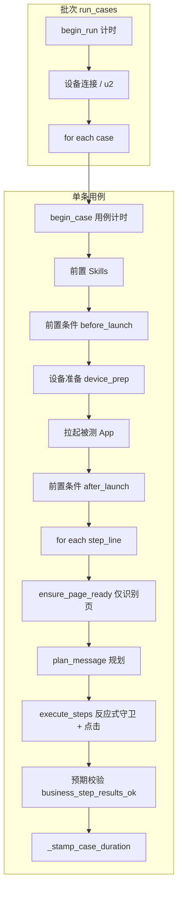
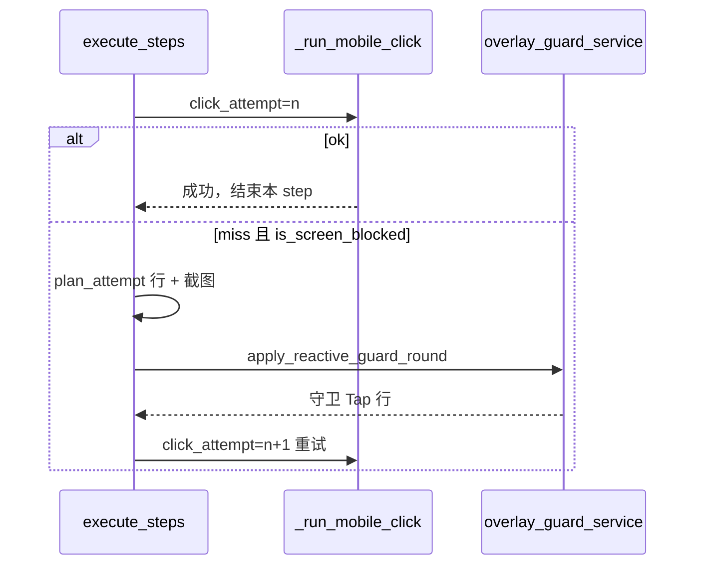

# 飞书回归用例：从启动到结束的执行方案

本文描述 `FeishuRegression` 批次执行全链路，便于审阅 **反应式 Overlay Guard**、多通道定位、耗时统计与回放 UI 的对应关系。

## 1. 总览

| 阶段 | 服务入口 | 回放 phase | 是否 begin_case 计时 |
|------|----------|------------|----------------------|
| 批次 | `feishu_regression_service.run_cases` | — | `run_t0` |
| 单用例 | `begin_case()` | — | `case_t0`（侧栏时间戳基准） |
| 设备准备 | `_append_device_prep_trace` | `device_prep` | 是 |
| 前置条件 | `_append_precondition_trace` | `precondition` | 是 |
| 操作步骤 | `_run_command_block` → Copilot | `operation` | 是 |
| 预期 | `_verify_step_expected` | `expected` | 是 |

## 2. 单步操作：规划 → 反应式守卫 → 执行

### 2.1 指令规划 `plan_message`

- 入口：`copilot_service.plan_message(text)`
- 将飞书步骤行拆成 `steps[]`；勾选类 → `kind=click`。
- 输出：`plan_log`（`planned_step`）、`reply`。
- **注意**：守卫的 `planned_step` 在运行结束后由 `merge_guard_plan_log` 合并进 `plan_log`，规划日志里会看到「守卫 · …」条目，但**实际执行顺序**由 `flat_items` / `run_elapsed_ms` 决定，不是写死在规划阶段。

### 2.2 页面前置 `ensure_page_ready_before_action`

- 回归模式（有 `run_id`）：**只识别当前页**，`overlay_guard_delegated=True`，**不**预执行同意 Tap。

### 2.3 Overlay Guard（反应式，非批量前置）

在 `execute_steps` 的 **click** 循环内：

- 每轮守卫：**一个** `守卫 · {类型}` Plan + **一次**处置 Tap（同意 / 仅在使用中允许等）。
- **不做** Detect / Recheck 展示节点；内部 Assert 仅日志。
- 阻塞屏上业务定位：`blocked_overlay` + 文案 `当前屏被{类型}占用`（见 `blocked_overlay_message`）。
- 守卫 label（同意、系统允许）走 `is_overlay_dismiss_target_label`，**不**被 `blocked_overlay` 挡住。

Consent / 系统权限处置见 [overlay-guard.md](../locate/overlay-guard.md)。

### 2.4 多通道定位 `resolve_locate_target`

| 通道 | 说明 |
|------|------|
| hierarchy | uiautomator |
| ocr | 文本框 |
| clip / gallery | OpenCLIP |
| icon_row | 登录行无字图标 |
| anchor | 图标库 |

业务 Tap 与守卫处置 Tap 共用仲裁；consent profile 阈值较低，过滤「不同意」。

### 2.5 成败判定与用例中断

| 判定 | 函数 / 规则 |
|------|-------------|
| 单条飞书步骤 `action_ok` | `business_step_results_ok(step_results)` — 每 index 最后一次业务结果 |
| 用例是否继续下一步 | `action_ok=False` → `break`（`stop_on_failure`） |
| 预期是否执行 | `action_ok` 为真才走 `_verify_step_expected`；否则跳过并注明「前置操作未成功」 |

中间 `plan_attempt` 失败**不**影响最终 `action_ok`（只要最后一次业务 Tap 成功）。

## 3. 耗时

### 3.1 用例总耗时

`case_started` → `_stamp_case_duration`，含冷启动、解锁、守卫重试、CLIP 网格等。

### 3.2 侧栏 `run_elapsed`

- 基准：`begin_case()` 的 `case_t0`。
- `stamp_run_timing` / `apply_run_timing` 写入各 execute 行。
- **设备准备**：锁屏检测 → `device_prep_lock`；解锁后 → `device_prep_unlocked`。
- **解锁**：MIUI 上滑 + PIN 约 15–30s（已优化轮询间隔，仍受系统动画影响）。

### 3.3 常见「步骤相加 ≠ 总耗时」来源

| 来源 | 说明 |
|------|------|
| App 冷启动 / 前台守护 | `launch_app`、`guard_test_app_foreground` |
| 守卫重试 | 多轮 OCR + 点击，单步可达 60–80s |
| CLIP full grid | 非阻塞时勾选框仍可能扫 198 patch |
| 步骤间 settle | 截图、`_inject_step_waits` |

## 4. 回放数据结构

### 4.1 `operation` 树

`build_operation_plan_tree(plan_log, execute_log)`：

- `plans[]`：按 `planned_step.index` 分组的动作列表（守卫 `1011+`）
- `flat_items[]`：`_build_flat_items_by_execution_order` — **全局按时间交错**
- 业务 Plan 重试时会在 `flat_items` 中**多次**出现同一 `plan_index` 的 Plan 节点（带不同 `run_elapsed`）

### 4.2 前端 `ExecutionReplayer.vue`

- 左栏：遍历 `flat_items`，Plan / Action 同级（`depth=1`）
- 动作匹配：`gesture_id` → `phase+click_attempt` → 序号兜底
- 右栏：`locate_debug` 多通道表、失败分析、手动标注

## 5. 环境变量

| 变量 | 默认 | 作用 |
|------|------|------|
| `LOCATE_ARBITRATOR` | `1` | 多通道仲裁 |
| `LOCATE_MIN_SCORE` | `0.55` | 通用最低分 |
| consent profile | ~0.18 | 同意按钮 |

## 6. 源码索引

| 模块 | 文件 |
|------|------|
| 批次 / 用例循环 | `feishu_regression_service.py` |
| 业务成败聚合 | `app_automation_service.business_step_results_ok` |
| 步骤执行 | `copilot_service.execute_steps` |
| 守卫 | `overlay_guard_service.py` |
| 回放树 | `app_automation_service.build_operation_plan_tree` |
| 计时 | `regression_run_context.py` |
| 回放 UI | `MiniOrange/src/components/ExecutionReplayer.vue` |

## 7. 延伸阅读

- [本轮改动总览](CHANGELOG-session.md)
- [Overlay Guard](../locate/overlay-guard.md)
- [预期断言](expectation-assert.md)
- [造好物登录问题集](zaohaowu-login-solutions.md)
- [回放 UI 已知问题](replay-ui-known-issues.md)
